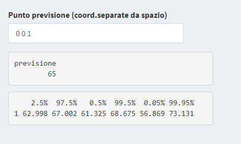

# Disegni Fattoriale completo

```{r include=FALSE}
load("Dati/Fatt_completo.RData")
load("Dati/Tab_Fatt_compl.RData")
```

I disegni fattoriali che analizziamo in questa dispensa sono utilizzati
principalmente per lo screening, cioè per determinare l'influenza di un
certo numero di fattori e delle loro interazioni su una risposta, e per
eliminare quelli che sono non significativi.

## Disegni fattoriali completi $2^k$

I disegni fattoriali completi sono disegni in cui sono indagate tutte le
possibili combinazioni dei livelli dei fattori. Se ad esempio il fattore
$X_1$ ha $a$ livelli (supponiamo a = 2) e il fattore $X_2$ ha $b$
livelli (supponiamo b=3), tutte le $ab$ (2x3=6) possibili combinazioni
dei livelli sono analizzate sperimentalmente. In questo paragrafo
consideriamo piani sperimentali in cui i fattori possono variare su $2$
livelli.

Siano $k$ i fattori che possono influenzare il fenomeno a cui siamo
interessati. In questo paragrafo vediamo come costruire un disegno
sperimentale che ci permetta di determinare quali fattori e
eventualmente quali interazioni tra questi fattori hanno effetto sui
risultati che otteniamo nello studio del fenomeno sotto osservazione.

Iniziamo con lo scegliere il dominio sperimentale, ossia l'insieme degli
intervalli di valori che possono essere assunti da ciascun fattore. Per
ogni fattore quindi dobbiamo scegliere i valori minimo e massimo
dell'intervallo entro cui studiare il fenomeno a cui siamo interessati.\
*Esempio*: studio della cottura di un uovo sodo. Supponiamo che il
risultato, ossia il grado di cottura dell'uovo, dipenda solo dal tempo
di immersione dell'uovo in acqua bollente. Il tempo di cottura quindi è
il fattore che studieremo tra due livelli. Il livello minimo è 5 minuti,
misurati dal momento dell'immersione dell'uovo nell'acqua bollente,
mentre il livello massimo è 10 minuti. Il dominio sperimentale in questo
caso è rappresentato dai tempi di cottura compresi tra 5 e 10 minuti
(compresi i due tempi estremi dell'intervallo).

Quando i fattori da considerare in un esperimento sono più di uno o due,
occorre rendere indipendenti i risultati dall'ordine di grandezza degli
intervalli di variazione dei diversi fattori. Se infatti un fattore
varia in un dominio che ha ordine di grandezza dei milioni (es. 5-10
milioni di cellule) e un altro fattore varia invece all'interno di un
dominio che ha ordine di grandezza delle unità (es. 1-3 ore), i
coefficienti del modello di regressione che si calcolano dipenderanno
molto dalla grandezza della variabile originaria. Quindi dopo avere
individuato il dominio sperimentale dei fattori che si vogliono
studiare, è necessario rendere uniforme (standardizzare) il dominio
sperimentale mediante la trasformazione di ogni fattore in modo tale che
tutti i fattori abbiano la stessa grandezza. La scelta più frequente è
quella di trasformare i valori "reali" dei fattori centrandoli
nell'origine e facendo si che il valore minimo di ogni fattore coincida
con il valore "-1" e il massimo con il valore "+1". In tale modo si
ottiene anche un dominio sperimentale che ha la forma di una figura
geometrica regolare (se k=2, siamo nel piano, otterremo un dominio
quadrato con lato di lunghezza pari a 2 privo di unità di misura; se
k=3, avremo un dominio nello spazio a 3 dimensioni rappresentato da un
cubo di spigolo avente lunghezza pari a 2 unità). La standardizzazione
si esegue applicando la seguente trasformazione:

$$
X'_i=2\frac{X_i-(X_{i,min}+\bar{X_i})}{X_{i,max}-X_{i,min}},
$$

dove $\bar{X_i}=(X_{i,max}-X_{i,min})/2$, in modo che $X'_i$ vari tra
$-1$ $(X_{i,min})$ e $1$ $(X_{i,max})$. Il dominio sperimentale standard
è ipercubo di $\mathbb{R}^k$ centrato nell'origine di lato $2$. I $2^k$
vertici dell'ipercubo sono i punti sperimentali.\newline Si noti che la
standardizzazione del dominio sperimentale ci permette un corretto
confronto tra i $k$ fattori (rendendo ogni fattore scalare e la
variazione di ogni fattore omogenea nel dominio sperimentale). Inoltre
il modello lineare che costruiamo dopo aver eseguito gli esperimenti
risulta molto semplificato.

La matrice del disegno sperimentale, ossia la matrice le
cui colonne sono i $k$ fattori e le cui righe sono i $2^k$ esperimenti è
data da Tabella \@ref(tab:MatrDisFull).

|       |  $\bf{X_1}$|  $\bf{X_2}$|  $\cdots$|  $\bf{X_k}$|
|:-----:|-----------:|-----------:|---------:|-----------:|
|   1   |          -1|          -1|         .|          -1|
|   2   |           1|          -1|         .|          -1|
|   3   |          -1|           1|         .|          -1|
|   4   |           1|           1|         .|          -1|
|   .   |           .|           .|         .|           .|
|   .   |           .|           .|         .|           .|
|   .   |           .|           .|         .|           .|
|   .   |          -1|          -1|         .|           1|
|   .   |           1|          -1|         .|           1|
|   .   |          -1|           1|         .|           1|
| $2^k$ |           1|           1|         .|           1|

: (\#tab:MatrDisFull) Matrice disegno completo $2^k$

Le colonne di tale matrice sono a due a due ortogonali, i $k$ fattori
indipendenti sono incorrelati.

Nell'applicativo selezionare la voce *Fattoriale completo/Disegno* nel
menù *Variabili indipendenti*. E' possibile scegliere il numero di
fattori per avere la matrice del disegno fattoriale completo $2^k$ e nel
caso di $k\leq 3$ una rappresentazione grafica del dominio sperimentale:
per il caso $k=2$ si veda la Figura \@ref(fig:fc1) e per $k=3$ la
Figura \@ref(fig:fc2).

```{r fc1, echo=FALSE, fig.align='center', fig.cap='Disegno fattoriale completo $2^2$', out.width="100%"}

```

```{r fc2, echo=FALSE, fig.align='center',fig.cap='Disegno fattoriale completo $2^3$',out.width="100%"}
knitr::include_graphics("Immagini/Fatt_compl/02_fattacompl3liv.png")
```

Consideriamo il modello lineare che tiene conto di tutti i termini
lineari e di tutte le possibili interazioni

\begin{equation}
y_i=\beta_0+\beta_1x_{i1}+\cdots+\beta_kx_{ik}+\beta_{12}x_{i1}x_{i2}+\cdots+\beta_{1\dots
k}x_{i1} \cdots x_{ik}+\epsilon_i, \qquad i=1,\dots,2^k, 
(\#eq:ModDisFull)
\end{equation}

dove $\epsilon_i\sim N(0,\sigma^2)$ a due a due non correlate, errore
sperimentale.\newline La matrice $X$ del modello è data dalla matrice in Tabella \@ref(tab:MatrModDisFull)

|       |  *Int.*|  $\bf{X_1}$|  $\bf{X_2}$|  $\cdots$|  $\bf{X_k}$|  $\bf{X_1X_2}$|  $\cdots$| $\bf{X_1X_2\dots X_k}$ |
|:-----:|-------:|-----------:|-----------:|---------:|-----------:|--------------:|---------:|:----------------------:|
|   1   |       1|          -1|          -1|  $\cdots$|          -1|              1|  $\cdots$|        $(-1)^k$        |
|   2   |       1|           1|          -1|  $\cdots$|          -1|             -1|  $\cdots$|   $\quad (-1)^{k-1}$   |
|   3   |       1|          -1|           1|  $\cdots$|          -1|             -1|  $\cdots$|            .           |
|   4   |       1|           1|           1|  $\cdots$|          -1|              1|  $\cdots$|            .           |
|   .   |       1|           .|           .|  $\cdots$|           .|              .|  $\cdots$|            .           |
|   .   |       1|           .|           .|  $\cdots$|           .|              .|  $\cdots$|            .           |
|   .   |       1|           .|           .|  $\cdots$|           .|              .|  $\cdots$|            .           |
|   .   |       1|          -1|          -1|  $\cdots$|           1|              1|  $\cdots$|            .           |
|   .   |       1|           1|          -1|  $\cdots$|           1|             -1|  $\cdots$|            .           |
|   .   |       1|          -1|           1|  $\cdots$|           1|             -1|  $\cdots$|            .           |
| $2^k$ |       1|           1|           1|  $\cdots$|           1|              1|  $\cdots$|            1           |


: (\#tab:MatrModDisFull) Matrice modello \@ref(eq:ModDisFull)


Poiché la matrice del modello \@ref(eq:ModDisFull) è ortogonale, i
coefficienti relativi ad ogni termine lineare forniscono esattamente
l'informazione di quanto varia la risposta per uno spostamento unitario
del fattore relativo, ossia $\frac{X_{max}-X_{min}}{2}$, mantenendo gli
altri parametri nulli. E' quindi 1/2 l'**effetto del parametro**,
cioè la differenza tra la media dei valori delle risposte per $X_{max}$
e la media dei valori delle risposte per $X_{min}$.\
Nell'esempio numerico che trattiamo più avanti, l'effetto del parametro
$X_1$ (temperatura), vedi Figura \@ref(fig:fc5), è dato dalla differenza
(23) tra la media (75.75) dei 4 valori della faccia $X_1=1$ e la media
(52.75) dei 4 valori della faccia $X_1=-1$. Il coefficiente di $X_1$,
vedi Figura \@ref(fig:fc6), è esattamente 1/2 l'effetto della temperatura.

Più grande in valore assoluto è il coefficiente, e maggiore è l'effetto
del relativo fattore nel dominio sperimentale scelto.

Determinato il vettore $y$ delle risposte, eseguendo i $2^k$ esperimenti
nei punti sperimentali individuati dalla matrice sperimentale in
Tabella \@ref(tab:MatrDisFull). (**Nota importante:** per evitare effetto
di autocorrelazione nell'errore nel modello gli esperimenti non vanno
eseguiti nell'ordine in Tabella \@ref(tab:MatrDisFull) ma vanno mischiati
casualmente) dobbiamo stimare

  - $1$ coefficiente interazione $\beta_0$ (media delle $2^k$ risposte)
  - $k$ coefficienti termini lineari $\beta_1,\cdots,\beta_k$
  - in generale $\frac{k!}{(k-m)!m!}$ coefficienti interazioni di ordine $m$


Si noti che per il binomio di Newton si ha che 
$$
\sum_{m=0}^k\frac{k!}{(k-m)!m!}=2^k. 
$$
La matrice del modello, Tabella \@ref(tab:MatrModDisFull), è quindi un matrice
quadrata $2^k$x $2^k$ e poiché le sue colonne sono a due a due
ortogonali è una matrice di Hadamard.

Dalla teoria della regressione sappiamo che uno stimatore del vettore
dei parametri $\beta$ del modello \@ref(eq:ModDisFull) è dato dall'unica
soluzione del sistema $y=Xb$ (si vedano le diapositive *Fattoriale
completo*) 
$$
 b=X^{-1}y.
$$ 
e che 
$$
Cov(b)=(X^tX)^{-1}=\frac{1}{2^k}I_k
$$ 
dove con $I_k$ è indicata la matrice diagonale con valori tutti
uguali a $1$ sulla diagonale (matrice identità).

Nell'applicativo, scelto il numero di fattori compaiono automaticamente
il modello e la matrice di dispersione (matrice $(X^tX)^{-1}$)
Figura \@ref(fig:fc3)

```{r fc3, echo=FALSE, fig.align='center',fig.cap='Modello e matrice di dispersione per un disegno fattoriale completo $2^3$',out.width="100%"}
knitr::include_graphics("Immagini/Fatt_compl/03_matr_disp.png")
```

Come già osservato, la matrice di dispersione è una matrice diagonale, e
questo implica che tutti i fattori sono ortogonali tra di loro 
$$
Corr(b_i,b_j)=0, \qquad i\neq j
$$ 
Il coefficiente $\beta_j$ non cambia anche se elimino qualche
fattore, o anche tutti i fattori $X_i,$ $i\neq j$ dal modello (la
variazione dovuta da $X_j$ sulla risposta è letta soltanto da
$\beta_j$).

Inoltre per lo stimatore $b=X^{-1}y$ abbiamo che

\begin{equation}
Var(b_j)=\frac{\sigma^2}{2^k},
\qquad j=1,\dots,2^k 
(\#eq:VarFull)
\end{equation}

La \@ref(eq:VarFull) ci dice la qualità dell'informazione dello
stimatore $b_j$. Ci permette inoltre di studiare la significatività
statistica di $\beta_j$ nota la varianza sperimentale $\sigma^2$.

Essendo $y=Xb$ un sistema di $2^k$ equazioni (linearmente indipendenti)
in $2^k$ incognite, non abbiamo gradi di libertà, e quindi non siamo in
grado di stimare $\sigma^2$. Alla fine di questo paragrafo vedremo, se
non è nota a priori la varianza $\sigma^2$, come possiamo superare
questo ostacolo.

Il valore previsto dal modello in un punto $(x_1,x_2,\dots,x_k)$ del
dominio sperimentale è dato da 
$$
\hat{y_0}=x_0b
$$ 
dove $x_0=(1,x_1,\dots,x_1x_2,\dots,x_1x_2\cdots x_k)$ (riga della
matrice del modello Tabella \@ref(tab:MatrDisFull) corrispondente al punto
$(x_1,x_2,\dots,x_k)$). Dalla teoria sappiamo che la varianza dello
stimatore $\hat{y_0}$ è data da 
$$
Var(\hat{y_0})=x_0(X^tX)^{-1}x_0^t\sigma^2
$$ 
La quantità $x_0(X^tX)^{-1}x_0^t$ è chiamata *Leverage* nel punto
$(x_1,x_2,\dots,x_k)$.

Nell'applicativo si trova il grafico del leverage per ogni punto del
dominio, Figura \@ref(fig:fc4)

```{r fc4, echo=FALSE, fig.align='center',fig.cap='Linee di livello e superficie del leverage per un disegno fattoriale completo $2^3$',out.width="100%"}
knitr::include_graphics("Immagini/Fatt_compl/04_lev.png")
```

La superficie di leverege ci dice com'è la qualità dell'informazione
dello stimatore risposta in ogni punto del dominio sperimentale.

A questo punto è opportuno fare due osservazioni importanti:

1)  il leverage non dipende dai valori delle risposte. Per questo si
    trova nel sotto-menù *Disegno* il cui output dipende solo dal
    disegno.

2)  nei punti del disegno, poiché la somma dei quadrati dei valori delle
    righe della matrice del modello Tabella \@ref(tab:MatrDisFull)è $2^k$, il
    valore del leverage è $1$.\
    Questo significa che il modello "deve passare" per quei punti, ma
    questo non deve meravigliare poiché, coma già detto, non abbiamo
    gradi di libertà. Per fissare le idee su questo passaggio
    fondamentale, siamo nello stessa situazione che conosciamo nel piano
    quando abbiamo solo due punti per stimare i coefficienti di una
    retta.

Si noti che i $2^k$ punti sperimentali sono i punti del dominio
sperimentale di leverage massimo. Il che significa che in ognuno di
questi punti l'informazione che abbiamo grazie al modello è migliore di
quella che avremmo mediante un (unico) eventuale esperimento in quel
punto. Ciò significa che la risposta, o meglio l'aspettativa della
risposta, può essere predetta meglio (leggi con varianza minore) dal
modello che da un singolo esperimento in quel punto. \newline

Consideriamo ora un esempio numerico.\
Supponiamo ora di dover identificare le condizioni di processo di una
reazione chimica. Vogliamo determinare l'influenza di 3 fattori

-   $X_1$: temperatura (°C)

-   $X_2$: concentrazione del substrato (%, p/p)

-   $X_3$: tipo di catalizzatore

e delle loro interazioni sulla risposta

-   $Y$: resa di reazione

Dobbiamo innanzitutto scegliere il dominio sperimentale, cioè per ogni
fattore dobbiamo determinare un intervallo di valori compreso tra un
massimo e un minimo entro i quali studiare il fenomeno a cui siamo
interessati. Abbiamo 2 fattori quantitativi, che sono la temperatura e
la concentrazione del substrato, e un fattore qualitativo a 2 livelli, e
questo è il tipo di catalizzatore: A o B.

```{r livelli, echo=FALSE}
knitr::kable(livelli,'simple',caption = 'Definizione dei livelli',align = "lrr",booktabs = TRUE)
```

La matrice del disegno Tabella \@ref(tab:MatrDisFull) per 3 fattori è quella in Figura \@ref(fig:fc2). Il piano degli esperimenti Tabella \@ref(tab:esperimenti) si
ottiene sostituendo a -1/+1 il valore corrispondente nella Tabella
\@ref(tab:livelli). \newpage

```{r esperimenti,echo=FALSE}
knitr::kable(esperimenti,'simple',caption = 'Piano degli esperimenti',align = "cccc",booktabs = TRUE)
```

Gli esperimenti sono elencati nel cosiddetto "ordine standard". Per
evitare di osservare effetti (errori) sistematici, gli esperimenti
devono essere eseguiti in ordine casuale (random order). Alla fine degli
esperimenti otteniamo i risultati in Tabella \@ref(tab:esperimentir)

```{r esperimentir, echo=FALSE}
knitr::kable(esperimenti_r,'simple',caption = 'Piano degli esperimenti  con risposte',align = "ccccc",booktabs = TRUE)
```

Per inserire le risposte nell'applicativo bisogna andare nel sotto menu
*Modello* e inserire le risposte nell'apposito riquadro, vedi Figura
\@ref(fig:fc5) (da Excel basta copiare la colonna delle risposte e
incollarla nel riquadro)

```{r fc5, echo=FALSE, fig.align='center',fig.cap="Inserimento risposte nell'applicativo",out.width="100%"}

```

Per un numero di fattori non superiore a 3 viene fornita anche una
rappresentazione grafica delle risposte.

Una volta inserite le risposte, il calcolo dei coefficienti del modello
è automatico e ne abbiamo anche una rappresentazione grafica, vedi
Figura \@ref(fig:fc6)

```{r fc6,echo=FALSE, fig.align='center',fig.cap="Calcolo dei coefficienti del modello",out.width="100%"}

```

Un altro grafico riportato è il *Grafico degli effetti normalizzati*,
Figura \@ref(fig:fc7), in cui sono rappresentati i coefficienti che
contribuiscono di più nel determinare la risposta. Il grafico
rappresenta la percentuale del contributo di ciascun coefficiente
elevato al quadrato alla somma dei quadrati di tutti i coefficienti. I
coefficienti che risultano dare un contributo in percentuale maggiore
sono quelli che che influenzano maggiormente la risposta.

```{r fc7, echo=FALSE, fig.align='center',fig.cap="Grafico degli effetti normalizzati",out.width="100%"}
knitr::include_graphics("Immagini/Fatt_compl/07_coeff_norm.png")
```

Dai grafici Figura \@ref(fig:fc6) e Figura \@ref(fig:fc7) risulta che i fattori
che influenzano di più la risposta Resa sono la temperatura e la sua
interazione con il tipo di catalizzatore.\
In Figura \@ref(fig:fc8) è illustrato il grafico della superficie di
risposta della Resa in funzione della temperatura e del tipo di
catalizzatore, avendo fissato la concentrazione del substrato nel punto
centrale del suo intervallo di variazione, vale a dire al 30%.

```{r fc8, echo=FALSE, fig.align='center',fig.cap="Grafico della superficie di risposta della Resa",out.width="100%"}
knitr::include_graphics("Immagini/Fatt_compl/08_sup_risp.png")
```

Come si nota dalla Figura \@ref(fig:fc8) il massimo della resa si ottiene
alla temperatura massima (180 °C) e usando il catalizzatore del tipo B
quando il substrato è alla concentrazione del 30%.

Circa la significatività dei coefficienti, per quanto già osservato
precedentemente, non abbiamo gradi di libertà e quindi non è possibile
stimare $\sigma^2$.

Una analisi grafica della significatività dei parametri $b_j$ può essere
effettuata mediante il *Normal Probability Plot*, Figura \@ref(fig:fc9). Se
tutti i coefficienti fossero nulli, i.e. se fossero tutti distribuiti
come una normale di media $0$ e varianza $\sigma^2/2^k$, essi sarebbero
distribuiti come una retta. Possiamo considerare significativamente non
nulli i coefficienti che si discostano dalla retta.

```{r fc9, echo=FALSE, fig.align='center',fig.cap="qq-plot dei coefficienti",out.width="100%"}
knitr::include_graphics("Immagini/Fatt_compl/09_qqplot.png")
```

Dal qq-plot in Figura \@ref(fig:fc9) si ottiene la conferma che sono
significativi (leggi: diversi da zero) la temperatura e la sua
interazione con il tipo di catalizzatore.

Per convalidare il modello eseguiamo alcune misure indipendenti
$\eta_1,\dots,\eta_p$ in un punto del dominio scelto arbitrariamente. In
generale si prende il centro del dominio perché è il punto in cui il
leverage è minore. Possiamo determinare $\sigma^2$ con lo stimatore $$
s^2=\frac{1}{p-1}\sum_{p=1}^p(\eta_i-\bar{\eta})^2.
$$ Possiamo costruire l'intervallo di confidenza della misura "vera" in
quel punto $$
\bar{\eta}\pm t(\alpha/2,p-1)s\sqrt{1/p}
$$ per $\alpha$ fissato (in generale $\alpha=95\%$).

Nel nostro caso essendo il terzo fattore qualitativo prendiamo il punto
centrale tra la temperatura e la concentrazione per il catalizzatore di
tipo B, ossia il punto $(X_1,X_2,X_3)=(0,0,1)$.\
Inserendo il valore delle misure indipendenti nell'applicativo,
Figura \@ref(fig:fc10) otteniamo il valore medio delle misure e il relativo
intervallo di confidenza al 95%, quindi il valore della deviazione
standard e dei gradi di libertà.

```{r fc10, echo=FALSE, fig.align='center',fig.cap="Misure indipendenti",out.width="100%"}

```

Inserendo le misure indipendenti abbiamo quindi una stima di $\sigma$ e
dei gradi di libertà. Utilizzando questi valori è possibile, grazie
all'equazione \@ref(eq:VarFull), costruire l'intervallo di confidenza dei
parametri del modello. Nell'applicativo si ottengono gli estremi degli
intervalli di confidenza dei parametri per alcuni valori di $\alpha$ e i
relativi $p-value$, Figura \@ref(fig:fc11)

```{r fc11, echo=FALSE, fig.align='center',fig.cap="Estremi degli intervalli di confidenza dei coefficienti",out.width="100%"}
knitr::include_graphics("Immagini/Fatt_compl/11_intconf.png")
```

Nel grafico dei parametri, l'ampiezza degli intervalli di confidenza è
rapprentata con un segmento di colore verde, Figura \@ref(fig:fc12)

```{r fc12, echo=FALSE, fig.align='center',fig.cap="Grafico dei coefficienti con estrremi degli intervalli di confidenza dei coefficienti",out.width="100%"}
knitr::include_graphics("Immagini/Fatt_compl/12_intcong_graf.png")
```

Per convalidare il modello bisogna quindi vedere quale è il valore
previsto dal modello nel punto in cui abbiamo eseguito le misure
indipendenti e verificare che non differisca significativamente dal
valore ottenuto dalle misure indipendenti (ossia appartenga
all'intervallo di confidenza determinato).\
Inserendo nell'applicativo le coordinate del punto in cui sono state
eseguite le misure indipendenti otteniamo la previsione del modello in
quel punto e gli estremi dell'intervallo di confidenza costruiti con la
stima di $\sigma$ ottenuta, Figura \@ref(fig:fc13)

```{r fc13, echo=FALSE, fig.align='center',fig.cap="Previsione del modello in un punto",out.width="100%"}

```

Nel nostro esempio numerico il modello risulta convalidato.
