# Piani Fattoriali Frazionari

```{r include=FALSE}
load("Dati/Fraz.RData")
```


All'aumentare del numero $k$ dei fattori, il numero degli esperimenti da eseguire in un disegno fattoriale completo (a 2 livelli) aumenta esponenzialmente come $2^k$.  
In Tabella \@ref(tab:exprich) è riportato il numero di esperimenti richiesti in funzione del numero di fattori $k$ nei piani sperimentali fattoriali completi.

```{r exprich, echo=FALSE}
knitr::kable(Exp,align = 'c',caption = 'Esperimenti richiesti per disegni fattoriali completi $2^k$',booktabs = TRUE)
```


E' possibile ridurre il numero di esperimenti, riducendolo di $\frac{1}{2},\frac{1}{4}, \dots$, costruendo  a partire da un disegno fattoriale completo $2^k$ un disegno fattoriale frazionario $2^{k-p}$ pur di accettare di "confondere" tra loro alcuni termini del modello. In generale, la strategia per fare questo consiste nel cercare di "confondere" termini di ordine maggiore che possono essere considerati trascurabili a priori, secondo il principio empirico della economia degli effetti (v. [Glossario](#glossario)).

Vediamo come possiamo costruire un disegno frazionario $2^{k-p}$ con un esempio specifico.  
Supponiamo di voler costruire il disegno $2^{5-2}$ ossia $1/4$ del disegno fattoriale completo $2^5$.  
Partiamo dal disegno $2^3$, vedi Tabella \@ref(tab:fatt3) 

```{r fatt3, echo=FALSE}
knitr::kable(Fatt_3,align = 'r',caption = 'Disegno fattorialo completo $2^3$',booktabs = TRUE)
```

a cui dobbiamo aggiungere i fattori mancanti $x_4$ e $x_5$ "confondendoli" con le interazioni $x_4=x_1x_2$ e $x_5=x_1x_3$. Otteniamo così il disegno Tabella \@ref(tab:fraz52) in cui la quarta colonna risulta il prodotto della prima con seconda e la quinta il prodotto tra la prima e la terza \newpage

```{r fraz52, echo=FALSE}
knitr::kable(Fraz_5_2,align = 'r',caption = 'Disegno frazionario $2^{5-2}$',booktabs = TRUE)
```

Diremo che $x_4=x_1x_2$ e $x_5=x_1x_3$ sono i generatori del disegno frazionario $2^{5-2}$.

Nell'applicativo, nel menù *Frazionario*, vengono costruiti i disegni frazionari $2^{k-p}$ indicando il numero di fattori $k$ e il numero di generatori $p$.   
In Figura \@ref(fig:fz1) abbiamo il risultato che si ottiene per $k=5$ e $p=2$, ossia il disegno $2^{5-2}$.

```{r fz1, echo=FALSE,fig.pos='ht', fig.align='center',fig.cap='Disegno frazionario $2^{5-2}$',out.width="100%"}
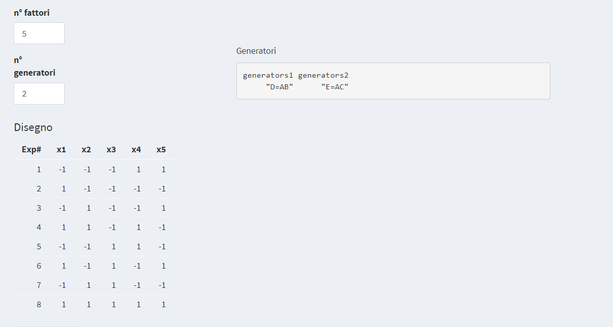
```

Si noti che i generatori sono indicati con le lettere maiuscole, e che queste corrispondono alle colonne della matrice disposte in ordine alfabetico (A è la prima colonna, B la seconda, C la terza, D la quarta ed E la quinta colonna)

Poiché ogni colonna della matrice del disegno elevata al quadrato è la colonna cosiddetta *identità*, *Int.*, costituita solo da valori uguali a 1, dalle relazioni $x_4=x_1x_2$ e $x_5=x_1x_3$ si ottiene facilmente che 

$$
Int.=x_1x_2x_4 \qquad  \rm{e} \qquad \it{Int.} = x_1x_3x_5 
$$


dette *Relazioni di identità*. La lunghezza (ordine delle interazioni) minima delle relazioni d'identità è chiamata *risoluzione* del disegno e, di solito, è indicata con un numero romano. Nel nostro esempio la risoluzione è $III$ e il disegno viene indicato con $2^{5-2}_{III}$.  
In linea di principio conviene scegliere relazioni di risoluzione massima (V e superiore) in quanto confondono termini di ordine maggiore. Questa di solito è l'indicazione data dalla maggior parte dei software professionali commerciali (v. Figura \@ref(fig:fz2)). Ma affinando l'esperienza e la pratica nell'uso dei fattoriali frazionari si constateranno le notevoli potenzialità offerte anche da disegni di ordine III e IV.

Nella Figura \@ref(fig:fz2), è riportata la copia della prima schermata da Design Expert®: sono indicati i disegni frazionari che si possono costruire in funzione del numero di fattori (per colonna) e numero di esperimenti (per riga) con la relativa risoluzione. 

```{r fz2, echo=FALSE,fig.pos='ht', fig.align='center',fig.cap='Disegni frazionari con risoluzione',out.width="100%"}
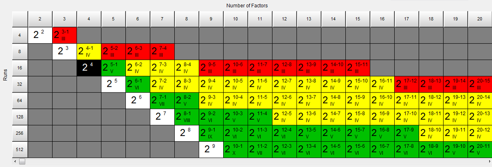
```

Per la ragione detta sopra, i programmatori di Design Expert® hanno assegnato dei codici-colore "semaforici" ai diversi disegni frazionari. Il colore del riquadro corrisponde al rischio di ottenere risultati inconcludenti. Perciò disegni con risoluzione $III$, in cui si "confondono" i termini lineari con le interazioni di ordine 2 sono colorati in rosso (rischio/attenzione alti); i disegni di risoluzione $IV$ in cui si "confondono" i termini lineari con le interazioni di ordine 3, e le interazioni di ordine 2 sono confuse a coppie tra loro, sono in giallo (rischio/attenzione medi). In verde, invece, sono indicati i disegni di risoluzione superiore a V (via libera, nessuna attenzione?). Questo tipo di classificazione è discutibile, come detto, ed è da considerare al pari di un consiglio di prudenza, peraltro scontato, perché l'uso dei fattoriali frazionari è da pensare per risolvere il problema chimico in esame, e non viceversa (i.e. come  adattare il problema ad un disegno frazionario di risoluzione sufficientemente alta).
La Figura \@ref(fig:fz2) è la prima immagine del menù *Frazionari* dell'applicativo.

Con semplice algebra, sempre osservando che $x_i^2=Int.$, i.e. ogni colonna al quadrato è la colonna identità $Int.$ formata da tutti 1, si ottengono tutte le altre "confusioni".  
Nell'applicativo compaiono automaticamente sia il modello relativo al disegno sia tutte le "confusioni", vedi Figura \@ref(fig:fz3)

```{r fz3, echo=FALSE,fig.pos='ht', fig.align='center',fig.cap='Modello e confusioni del disegno frazionario $2_{III}^{5-2}$',out.width="100%"}
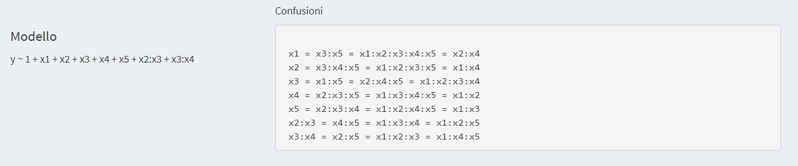
```


Per quanto riguarda la rimanente parte di output, tutto è presentato nella stessa logica già vista per i disegni fattoriali completi.  

## Esempio: confusioni

Per comprendere meglio le "confusioni" in un disegno frazionario consideriamo il seguente esempio didattico. Supponiamo che il modello "vero" (quello che a priori non conosciamo) del fenomeno di studio sia il seguente
$$
y=x_1+5x_2-3x_3+15x_1x_3+\epsilon
$$
Nella progettazione degli esperimenti per studiare il fenomeno in osservazione abbiamo ipotizzato che la risposta dipenda da 5 fattori $x_1,x_2,x_3,x_4,x_5$.

Per studiare tutte le possibili interazioni consideriamo un disegno fattoriale completo Tabella \@ref(tab:Conffull)

```{r Conffull, echo=FALSE}
knitr::kable(round(Confusioni_full,2),align = 'r',caption = 'Disegno fattoriale completo $2^5$ (32 esperimenti) con risposte costruito dal modello "vero" ipotizzato $y=x_1+5x_2-3x_3+15x_1x_3+\\epsilon$',booktabs = TRUE)
```

Il cui grafico dei coefficienti è dato in Figura \@ref(fig:fz11).

```{r fz11, echo=FALSE,fig.pos='ht', fig.align='center', fig.cap='Grafico dei coefficienti del modello $2^5$ ',out.width="100%"}
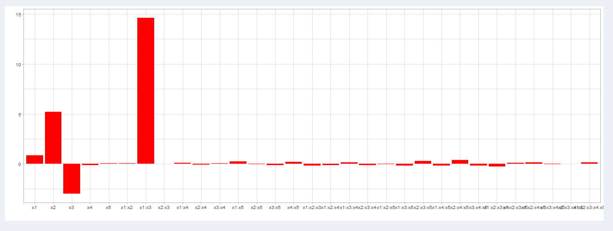
```

Per ridurre della metà il numero di esperimenti si considera un disegno frazionario $2^{5-1}_V$, Tabella \@ref(tab:Confris5)
\newpage

```{r Confris5, echo=FALSE}
knitr::kable(round(Confusioni_ris5,2),align = 'r',caption = 'Disegno frazionario $2^{5-1}_V$ (16 esperimenti) con risposte costruito dal modello supposto $y=x_1+5x_2-3x_3+15x_1x_3+\\epsilon$',booktabs = TRUE)
```

In questo caso il grafico dei parametri è dato da Figura \@ref(fig:fz12)

```{r fz12, echo=FALSE,fig.pos='ht', fig.align='center', fig.cap='Grafico dei coefficienti del modello frazionario $2^{5-1}_V$ ',out.width="100%"}
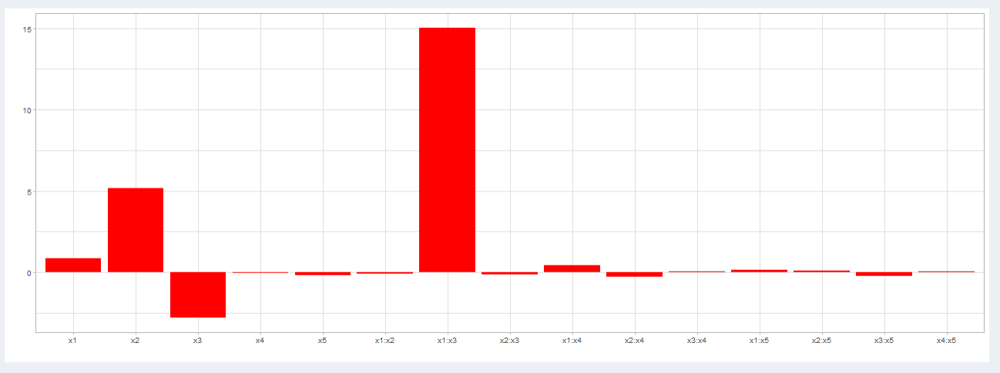
```

\newpage
Il disegno scelto ha risoluzione $V$, ciò significa che i termini lineari sono confusi con le interazioni di ordine 4 e quindi posssiamo supporre che il valore di ciascun parametro si riferisca al termine lineare corrispondente (consideriamo trascurabili tutte le interazioni di ordine 4). E' possibile fare un ragionamento analogo per le interazioni di ordine 2 che si confondono con le interazioni di ordine 3. Supponendo che queste ultime siano trascurabili, possiamo dunque concludere che il valore di ciascun parametro di interazione si riferisca easclusivamente alle interazioni di ordine 2. 

Se si volesse diminuire ulteriormente il numero di esperimenti, è possibile ricorrere ad un disegno frazionario $2^{5-2}_{III}$, Tabella \@ref(tab:Confris3)


```{r Confris3, echo=FALSE}
knitr::kable(round(Confusioni_ris3,2),align = 'r',caption = 'Disegno frazionario $2^{5-2}_{III}$ (8 esperimenti) con risposte costruito dal modello supposto $y=x_1+5x_2-3x_3+15x_1x_3+\\epsilon$',booktabs = TRUE)
```

Questo è un disegno di risoluzione $III$, bisogna quindi fare molta attenzione alle confusioni Figura \@ref(fig:fz13)

```{r fz13, echo=FALSE,fig.pos='ht', fig.align='center', fig.cap='Confusioni del disegno $2^{5-2}_{III}$',out.width="100%"}
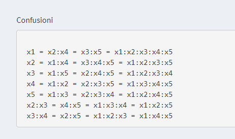
```

I termini lineari si confondono con le interazione di ordine 2. Come si vede dal grafico dei coefficienti Figura \@ref(fig:fz14)

```{r fz14, echo=FALSE,fig.pos='ht', fig.align='center', fig.cap='Grafico dei coefficienti del disegno $2^{5-2}_{III}$',out.width="100%"}
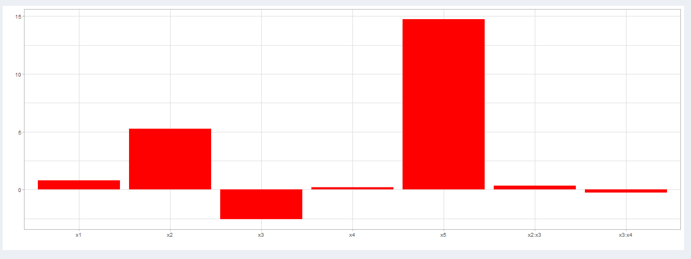
```

ad esempio il valore di $x_5$ è circa 15, ma non siamo in grado di stabilire se è dovuto dal termine linerare $x_5$, dal termine "confuso" $x_1x_3$ (come in questo caso, ricordo la forma del modello $y=x_1+5x_2-3x_3+15x_1x_3+\epsilon$) o dalla combinazione di entrambi.


## Esempio: studio dei fattori dell'estrazione liquido-liquido

Per meglio comprendere i disegni frazionari e l'utilizzo dell'applicativo in questi disegni consideriamo il seguente esempio.

Si vogliono studiare i seguenti 4 fattori:

- volume miscela solventi per estrazione

- tempo di centrifuga dell’estratto

- forza ionica del campione (quantità di NaCl da aggiungere)

- tempo di estrazione

Definiamo innanzitutto il dominio sperimentale. Per ogni fattore determiniamo l'intervallo di valori compreso tra un massimo e un minimo entro i quali studiare il fenomeno, Tabella \@ref(tab:fzliv)

```{r fzliv, echo=FALSE}
knitr::kable(Liv,caption = 'Definizione dei livelli',align = "lcc",booktabs = TRUE)
```

Il piano fattoriale completo prevede 16 esperimenti. L'impegno del laboratorio è considerato troppo oneroso. Si decide quindi di utilizzare un disegno frazionario $2^{4-1}_{IV}$ per eseguire la metà degli esperimenti. Vedi Figura \@ref(fig:fz4) 

```{r fz4, echo=FALSE,fig.pos='ht', fig.align='center',fig.cap='Disegno e generatore di  $2_{IV}^{4-1}$',out.width="100%"}
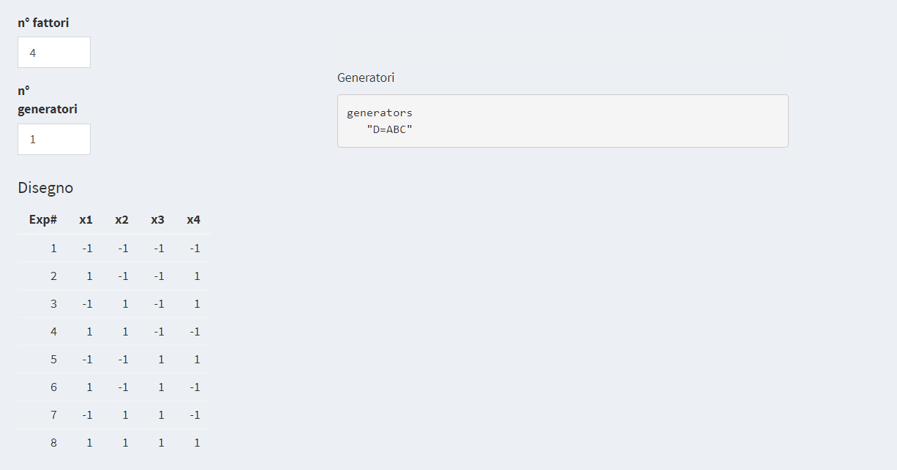
```

Il piano sperimentale risulta quindi Tabella \@ref(tab:piano)
\newpage

```{r piano, echo=FALSE, paged.print=TRUE}
knitr::kable(Piano[,-5],align = 'c',caption = 'Piano sperimentale',booktabs = TRUE)
```

Il modello e le "confusioni" sono dati in Figura \@ref(fig:fz5)

```{r fz5, echo=FALSE,fig.pos='ht', fig.align='center',fig.cap='Modello e condusioni del frazionario di  $2_{IV}^{4-1}$',out.width="100%"}
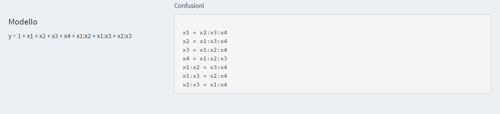
```

Il disegno è di risoluzione $IV$ quindi, come si vede in Figura \@ref(fig:fz5), abbiamo "confusione" tra i termini lineari e le interazioni di ordine 3 e tra le coppie di interazioni di ordine 2.

Vengono quindi eseguiti, in ordine casuale, gli 8 esperimenti ottenendo per la risposta *Resa* i seguenti valori, Tabella \@ref(tab:fzpianorisp)


```{r fzpianorisp, echo=FALSE}
knitr::kable(Piano,align = 'c',caption = 'Piano sperimentale $2_{IV}^{4-1}$ con risposte',booktabs = TRUE)
```

Inserendo nell'applicativo gli 8 valori della *Resa* ottenuti (in ordine come in Tabella \@ref(tab:fzpianorisp), otteniamo la stima puntuale dei parametri Figura \@ref(fig:fz6) e il relativo grafico Figura \@ref(fig:fz7).

```{r fz6, echo=FALSE,fig.pos='ht', fig.align='center',fig.cap='Stima puntuale dei parametri',out.width="100%"}
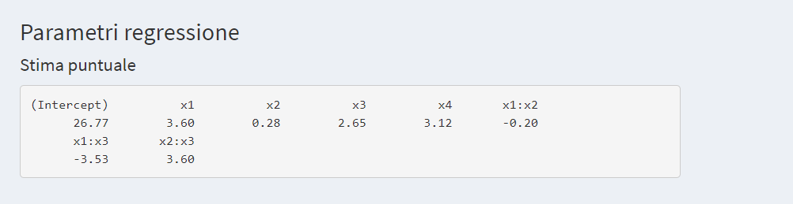
```


```{r fz7, echo=FALSE,fig.pos='ht', fig.align='center',fig.cap='Grafico dell stima puntuale dei parametri',out.width="100%"}
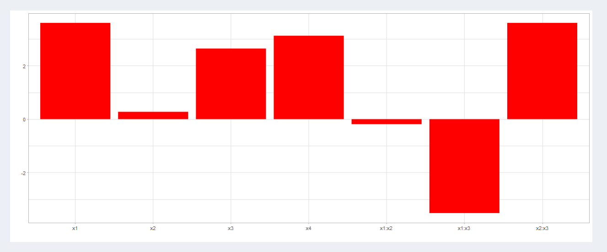
```

Ricordando le "confusioni" Figura \@ref(fig:fz5) e che il disegno è di risoluzione $IV$ abbiamo che il termini lineari sono "confusi" con le interazioni di ordine 3, possiamo quindi supporre che i valori dei parametri $x_1,x_2,x_3$ e $x_4$ si riferiscano ai termini linerari mentre rimangono le "confusioni" a coppie per le interazioni di ordine 2.   
Il modello risulta quindi
$$
y=26.77+3.60x_1+0.28x_2+2.65x_3+3.12x_4-0.2(x_1x_2+x_3x_4)-3.53(x_1x_3+x_2x_4)+3.60(x_1x_4+x_2x_3)
$$

Il fattore $x_2$ ha coefficiente piccolo e non sembra importante, mentre gli altri tre termini lineari lo sono sicuramente.  
Quindi si può sostenere l’ipotesi che le interazioni confuse siano dovute ai termini diversi da $x_2$.  
Questa osservazione è di fatto risultata coerente con il dato sperimentale osservato secondo cui il tempo di centrifuga non ha alcun effetto sulla resa di estrazione perché il livello più basso scelto è già più che sufficiente per rompere l’emulsione creata dopo la miscelazione delle fasi del solvente di estrazione e del campione.
Tali conclusioni sono confermate dal piano $2^4$ poi condotto a termine.

Il modello finale semplificato quindi è

$$
y=26.77+3.60x_1+2.65x_3+3.12x_4-0.2x_3x_4-3.53x_1x_3+3.60x_1x_4
$$

Per convalidare il modello sono state eseguite misure indipendenti nel punto test $(1-1,-1,-1,-1)$. Inserendo le rese osservate $17.2,16.9,17.0,16.8$ nell'apposita casella dell'applicativo si ottiene Figura \@ref(fig:fz8)

```{r fz8, echo=FALSE, fig.align='center', fig.cap='Misure indipendenti nel punto test', fig.pos='ht', out.width="100%"}
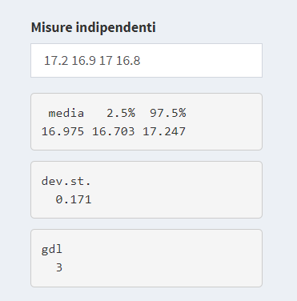
```

La risposta predetta nel punto test e gli estremi dell'intervallo di confidenza costruito con la stima di $\sigma$ ottenuta con le 4 misure indipendenti sono dati in Figura \@ref(fig:fz9).

```{r fz9, echo=FALSE,fig.pos='ht', fig.align='center',fig.cap="Previsione nel punto test e estremi dell'intervallo di confidenza",out.width="100%"}
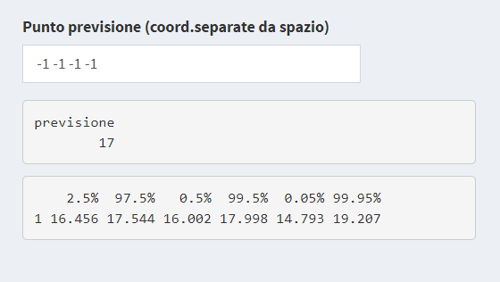
```

Il modello è convalidato statisticamente e può quindi essere usato per esplorare in modo attendibile il dominio delle risposte, Figura \@ref(fig:fz10)

```{r fz10, echo=FALSE,fig.pos='ht', fig.align='center',fig.cap="Grafico della superficie di risposta",out.width="100%"}
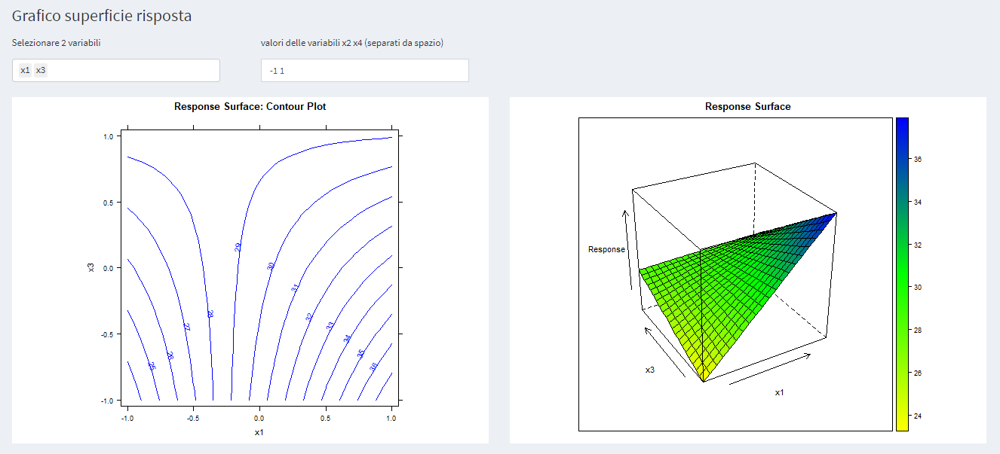
```

