# Plackett Burman

```{r include=FALSE}
load("Dati/PB.RData")
```

I disegni frazionari $2_{III}^{k-p}$ di risoluzione $III$ sono usati prevalentemente per condurre studi di screening e di robustezza. Il numero di esperimenti di un qualsiasi piano fattoriale frazionario è comunque uguale ad un numero di esperimenti esponenziale $2^n$: 8, 16, 32, ... . 
Plackett e Burman nel 1946 hanno introdotto una classe di disegni fattoriali a $2$ livelli ortogonali che permettono di condurre lo screening di $n-1$ fattori prevedendo lo svolgimento di un numero $n=4m$ di esperimenti (4, 8, 12, 16, 20, 24, ...), in modo tale da offrire le opzioni per colmare i vuoti esistenti ad esempio tra piani di 8 e 16, oppure di 16 e 32 esperimenti.   
Nel caso in cui $n$ sia anche una potenza di $2$ (4, 8, 16, ...), il disegno di PB corrispondente è un particolare disegno frazionario di risoluzione $III$.

La matrice sperimentale di questi disegni si costruisce seguendo un procedimento iterativo in cui, data la prima riga della matrice (vedi Tabella \@ref(tab:PBAlg) di lunghezza $n-1$, si generano le righe successive per permutazione circolare di questa riga (ogni riga ha al primo posto l'elemento che era all'ultimo posto della riga superiore e agli altri $i=2,\dots, n-1$ l'elemento di posto $i-1$ della riga superiore; in totale in questo modo si scrivono $n-1$ righe, compresa la prima riga data, e a queste si aggiunge una ultima riga composta da solo $-1$.

| n        |     |     |     |     |     |     |     |     |     |     |     |     |     |     |     |     |     |     |     |
|:---------|----:|----:|----:|----:|----:|----:|----:|----:|----:|----:|----:|----:|----:|----:|----:|----:|----:|----:|----:|
| 4        |    1|    1|   -1|     |     |     |     |     |     |     |     |     |     |     |     |     |     |     |     |
| 8        |    1|    1|    1|   -1|    1|   -1|   -1|     |     |     |     |     |     |     |     |     |     |     |     |
| 12       |    1|    1|   -1|    1|    1|    1|   -1|   -1|   -1|    1|   -1|     |     |     |     |     |     |     |     |
| 16       |    1|    1|    1|    1|   -1|    1|   -1|    1|    1|   -1|   -1|    1|   -1|   -1|   -1|     |     |     |     |
| 20       |    1|    1|   -1|   -1|    1|    1|    1|    1|   -1|    1|   -1|    1|   -1|   -1|   -1|   -1|    1|    1|   -1|
| $\cdots$ |     |     |     |     |     |     |     |     |     |     |     |     |     |     |     |     |     |     |     |
: (\#tab:PBAlg)


Vediamo ad esempio la costruzione della matrice per $n=4.$ La prima riga della matrice, vedi Tabella \@ref(tab:PBAlg), è:   
\begin{equation*}
    1 \qquad 1 \qquad -1.
\end{equation*}
Generiamo le altre righe $2$ righe per permutazione circolare e aggiungiamo la quarta riga costituita da $-1$.

+-----------------+-----------------+-----------------+----------------+
|                 | $\bf{X_1}$      | $\bf{X_2}$      | $\bf{X_3}$     |
+:===============:+================:+================:+===============:+
| 1               | 1               | 1               | -1             |
+-----------------+-----------------+-----------------+----------------+
| 2               | -1              | 1               | 1              |
+-----------------+-----------------+-----------------+----------------+
| 3               | 1               | -1              | 1              |
+-----------------+-----------------+-----------------+----------------+
| 4               | -1              | -1              | -1             |
+-----------------+-----------------+-----------------+----------------+


: Plackett Burman con 4 esperimenti


Il modello associato a questi disegni tiene conto di tutti i fattori lineari
\begin{equation*}
     y_i=\beta_0+\beta_1x_{i1}+\cdots+\beta_{n-1}x_{i,n-1}+\epsilon_i, \qquad i=1,\dots,n,
\end{equation*}
la matrice del modello é uguale alla matrice sperimentale a cui va aggiunta una prima colonna di tutti $1$. Abbiamo per lo stimatore $b=X^{-1}Y$
\begin{equation*}
    Cov(b)=\frac{\sigma^2}{n}I_{n},
\end{equation*}
abbiamo cioè
\begin{equation*}
    Var(b)=\frac{\sigma^2}{n}, \qquad j=1,\dots,n
\end{equation*}
e
\begin{equation*}
    Corr(b_i,b_j)=0, \qquad i\neq j.
\end{equation*}


Nell'applicativo, selezionando il numero di fattori da studiare, viene proposto il disegno di Plackett-Burman con con un numero di esperimenti pari al minimo multiplo di 4 maggione del numero del numero di fattori, Figura \@ref(fig:pb1).

```{r pb1, echo=FALSE, fig.align='center',fig.pos='ht',fig.cap='Disegno di Plackett-Burman per 5 fattori',out.width="100%"}
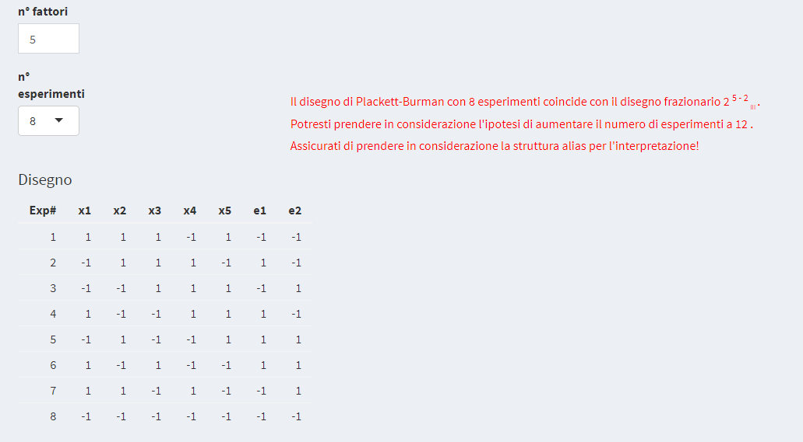
```
Si noti che le prime 5 colonne sono "occupate" dai 5 fattori in analisi indicate con $x_1, \dots,x_5$ mentre vengono indicate con $e_1,e_2$ le 2 colonne rimanenti. Queste sono 2 variabili cosiddette *dummy* (variabili fittizie) che possono essere utili per stabilire la significatività dei fattori in studio. Si vedano al riguardo gli esempi nel seguito.


I disegni di Plackett-Burman sono disegni di risoluzione $III$, nel senso che le interazioni sono confuse con i termini lineari. Nel caso in cui il numero di esperimenti $n$ sia una potenza di $2$, come abbiamo già detto, il disegno di Plackett-Burmann è un particolare disegno frazionario di risoluzione $III$ e quindi i termini lineari sono "completamente confusi" con le interazioni (si veda la sezione dedicata ai disegni frazionari). Nei casi in cui $n$ non è una potenza di $2$, per determinare le relazioni "confuse" si considerano la matrice $X_1$ del modello Tabella \@ref(tab:matrmod)\newpage

```{r matrmod, echo=FALSE}
knitr::kable(matr.mod,caption = 'Matrice del modello',booktabs = TRUE)
```

e la matrice $X_2$ dei termini (interazioni) confusi Tabella \@ref(tab:pbmatrconf)

```{r pbmatrconf,echo=FALSE}
knitr::kable(matr.conf,caption = 'Matrice delle interazioni confuse',booktabs = TRUE)
```


La matrice A, spesso indicata anche con il nome di "*alias matrix*", o matrice di confusione, è definita dalla relazione algebrica
$$
A=(X_1^tX_1)^{-1}(X_1^tX_2)
$$
La matrice A ha tante righe quanti sono i termini del modello (in questo caso 8: intercetta, 5 fattori e due variabili fittizie) e tante colonne quante sono le interazioni possibili (in questo caso 21 interazioni a due termini), e si chiama matrice di confusione.   
In Figura \@ref(fig:pb2) è illustrata la matrice di confusione relativa al modello di Plackett-Burman per 5 fattori di cui è data la matrice in Figura \@ref(fig:pb1). Nella matrice di confusione, in ogni riga si può leggere la "confusione" di ogni termine lineare con le interazioni di due termini. 

```{r pb2, echo=FALSE, fig.align='center',fig.pos='ht',fig.cap='Matrice di confusione',out.width="100%"}
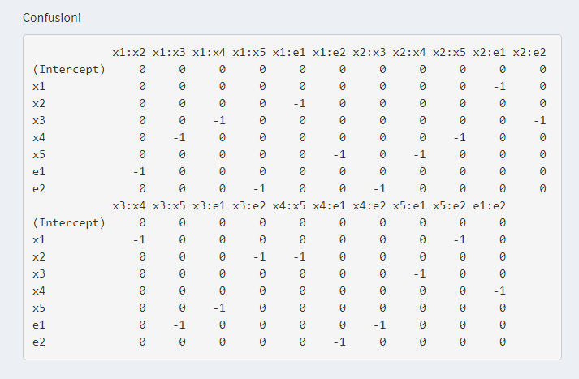
```

Il caso in esame è un frazionario $2^{5-2}_{III}$ e le confusioni, come ci aspettiamo, sono "totali" o "complete": ciò significa che ogni interazione è "confusa" con un solo termine lineare. Si noti che nella matrice di confusione di questo modello appaiono solo segni 0 o -1. 

Scegliendo 12 esperimenti, la matrice di confusione è quella data in Figura \@ref(fig:pb3)

```{r pb3, echo=FALSE, fig.align='center',fig.pos='ht',fig.cap='Parte della matrice di confusione di un disegno di Plackett-Burman con 12 esperimenti',out.width="100%"}
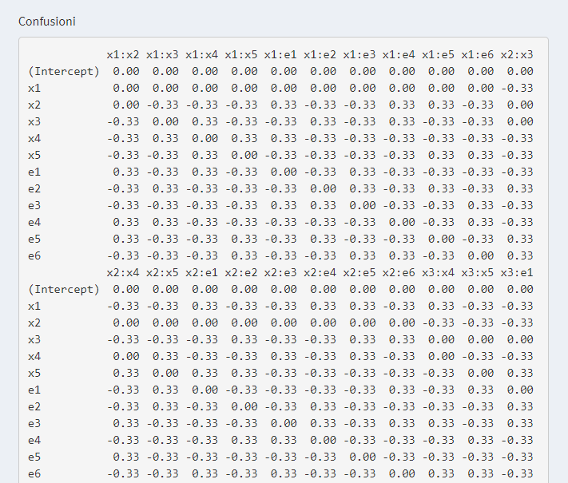
```

In questo caso le "confusioni" sono "parziali", cioè le interazioni si confondono "parzialmente" con più termini lineari. Questo ci permette di stimare le interazioni con l'analisi di regressione. Possiamo sostituire gli effetti lineari meno significativi con le interazioni più importanti. Per determinare le interazioni più rilevanti si moltiplicano per un'interazione fissata le confusioni con i termini lineari più grandi per il segno del coefficiente del termine lineare e se ne fa la somma. Nell'applicativo è proposto il grafico delle confusioni (Plot alias) in cui è rappresentata visivamente tale somma Figura \@ref(fig:pb4)


Per meglio chiarire quanto finora detto detto facciamo 2 esempi numerici.

## Esempio: confusioni
Come fatto nel caso del disegno frazionario, per capire le "confusioni" in un disegno di Plackett-Burman, consideriamo un modello teorico di un ipotetico fenomeno in esame
$$
y=x_1+5x_2-3x_3+15x_4-15x_1x_3+\epsilon
$$
e supponiamo che si vogliano analizzare gli effetti di 5 fattori
$$
x_1,x_2,x_3,x_4,x_5
$$
perché dall'analisi preliminare del problema è emerso che potrebbero essere importanti nell'influenzare la risposta.

Con 5 fattori il primo disegno di Plackett-Burman "utile" è quello che prevede di eseguire 8 esperimenti Tabella \@ref(tab:pbes1)

```{r pbes1, echo=FALSE}
knitr::kable(Confusioni8,caption = 'Disegno di Plackett-Burman con 8 esperimenti con risposte costruite dal modello supposto
            $y=x_1+5x_2-3x_3+15x_4-15x_1x_3+\\epsilon$ ',booktabs = TRUE)
```

E' un disegno fattoriale frazionario a due livelli con risoluzione $III$. I termini lineari sono confusi con i termini di interazione di ordine 2. Si noti il valore $-1$ nella matrice delle confusioni Figura \@ref(fig:pb6)

```{r pb6, echo=FALSE, fig.align='center',fig.pos='ht',fig.cap='Matrice delle confusioni di un pb con 8 esperimenti',out.width="100%"}
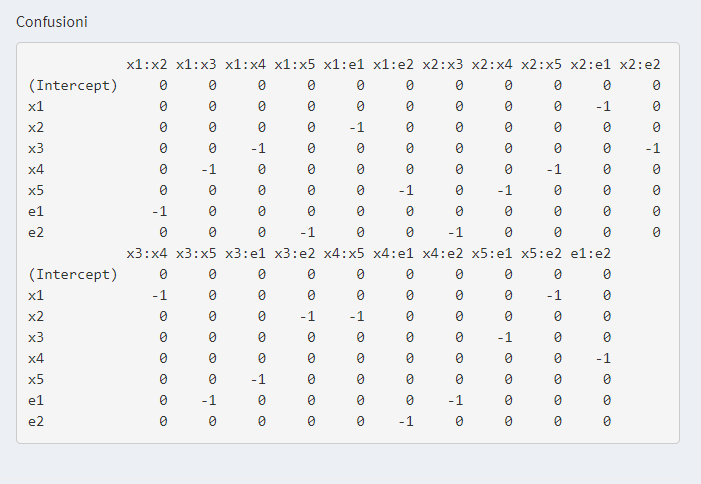
```

Il grafico dei coefficienti è dato da Figura \@ref(fig:pb7)

```{r pb7, echo=FALSE, fig.align='center',fig.pos='ht',fig.cap='Grafico dei coefficienti del pb con 8 esperiemnti',out.width="100%"}
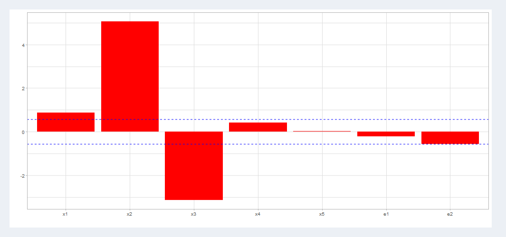
```
\newpage
Se a priori non possiamo escludere nessuna interazione di ordine 2, potrebbe accadere che la non significatività dei termini $x_4$ e $x_5$ sia dovuta al fatto che si annullino con le interazioni di ordine 2 con cui sono confusi. Ad esempio, $x_4$ potrebbe annullarsi con $x_1x_3$ ($x_4$ si confonde con $-x_1x_3$ e, se i coefficienti di questi termini hanno valore numerico simile, come nel nostro esempio, si annullano).  
Anche per le dummy bisogna fare attenzione e essere sicuri che non appaiano importanti perchè "rappresentano" in realtà una interazione confusa con esse.

Non possiamo sapere quindi se la significatività che osserviamo per alcuni termini è autentica, ossia dovuta realmente al fattore stesso, oppure derivi dalle interazioni confuse con ciascun termine. In questi casi, è solo la conoscenza tecnica del problema chimico (o fisico o ingegneristico) che può aiutare a definire la reale importanza dei diversi termini e a giungere alla conclusione di escludere alcune interazioni (perché ad esempio prive di senso fisico o impossibili tecnicamente).

Se a priori invece non si può escludere nessuna interazione, si può prendere in considerazione il piano sperimentale di Plackett-Burman successivo, ossia quello che prevede 12 esperimenti. Questo numero di prove è comunque inferiore a quello del fattoriale frazionario corrispondente che è il $2^{5-1}_V$), e conta quindi 16 esperimenti, Tabella \@ref(tab:pb12)
\newpage

```{r pb12,echo=FALSE}
knitr::kable(Confusioni12,caption = 'Disegno di Plackett-Burman con 12 esperimenti con risposte costruite dal modello ipotizzato
            $y=x_1+5x_2-3x_3+15x_4-15x_1x_3+\\epsilon$ ',booktabs = TRUE)
```

Il grafico dei coefficienti è dato da Figura \@ref(fig:pb8)

```{r pb8, echo=FALSE, fig.align='center',fig.pos='ht',fig.cap='Grafico dei coefficienti del piano di Plackett-Burman con 12 esperimenti',out.width="100%"}
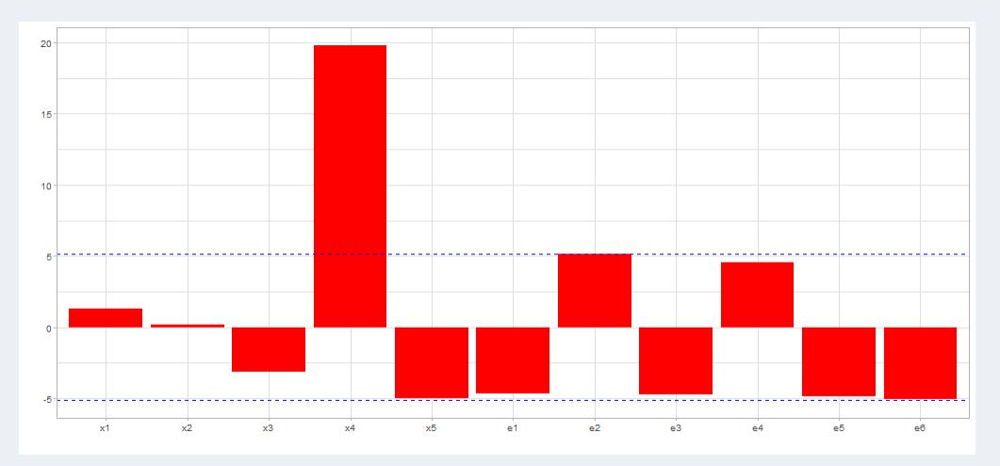
```

Quando si applicano piani di Plackett-Burman quindi è molto importante prestare la massima attenzione alla significatività dei fattori e alle possibili interazioni confuse con essi. Questo vale a maggior ragione per le variabili dummy che, come visto, possono essere confuse con le interazioni coppie al pari di qualsiasi altro fattore compreso nel piano degli esperimenti.  
Nel caso di un piano sperimentale di 12 esperimenti,le confusioni sono parziali. Si noti il valore $-0.33$ nella matrice delle confusioni Figura \@ref(fig:pb3). Tale valore permette di stimare le interazioni con l’analisi di regressione. Possiamo sostituire gli effetti lineari meno importanti con le interazioni più significative.
\newpage
Per determinare le interazioni più significative, si moltiplicano queste per una interazione fissata, si moltiplicano le confusioni con i termini lineari più importanti per il segno del coefficiente del termine lineare e se ne fa la somma Figura \@ref(fig:pb9).

```{r pb9, echo=FALSE, fig.align='center',fig.pos='ht',fig.cap='Grafico dei coefficienti del pb con 12 esperimenti',out.width="100%"}
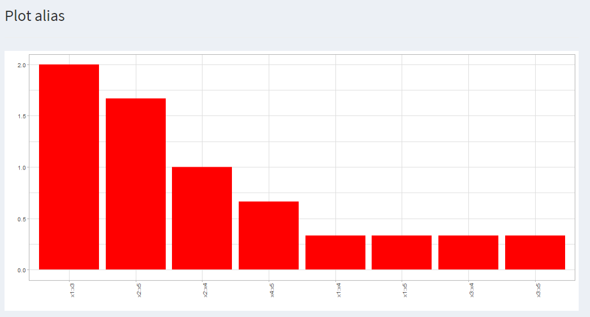
```

Con l'applicativo possiamo innanzitutto scaricare un disegno di Plackett-Burman con 12 esperimenti e quindi ricaricare il file salvato nel menù *Piano Personalizzato* (se si preferisce si può anche importare il disegno con copia/incolla). Vedi Figura \@ref(fig:pb10)

```{r pb10, echo=FALSE, fig.align='center',fig.pos='ht',fig.cap='Selezione delle variabili',out.width="100%"}
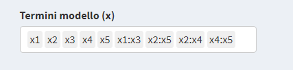
```

Una volta importato il datset selezioniamo i termini del modello che vogliamo studiare. Nel nostro caso ad esempio possiamo considerare i 5 termini lineari e le 4 interazioni $x_1x_3,x_2x_5,x_2x_4,x_4x_5$ che hanno maggiore probabilità di essere significative, vedi Figura \@ref(fig:pb9).  
Inserendo le 12 risposte nell'opportuno riquadro otteniamo il seguente grafico dei coefficienti Figura \@ref(fig:pb11).

```{r pb11, echo=FALSE, fig.align='center',fig.pos='ht',fig.cap='Selezione delle variabili',out.width="100%"}
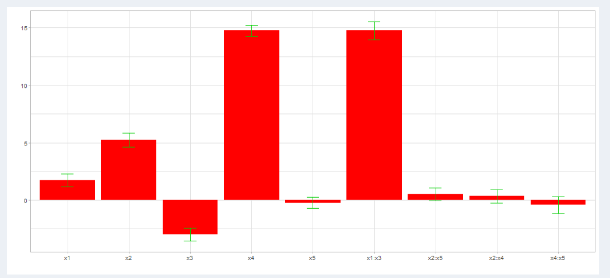
```

Tale grafico evidenzia la significatività sia di $x_4$ che dell'interazione $x_1x_3$ che non riuscivamo a distinguere poiché questi termini, a causa delle confusioni, si annullavano a vicenda.


## Esempio Elvitegravir
Il problema è lo sviluppo di un metodo semplice per l’isolamento di un principio attivo da plasma umano preliminare all’analisi HPLC-ESI/MS/MS. La risposta è la sensibilità S/N, che si vuole massimalizzzare.   
Tra tutti i fattori considerati si è deciso di considerare i 5 fattori:

+ x1: Solvente (agente precipitante)
+ x2: Volume di plasma	(µL)
+ x3: Volume di solvente	(rapp v.campione)
+ x4: Tempo miscelazione (sec)
+ x5: Temperatura centrifuga (°C)

Il dominio sperimentale è definito in Tabella \@ref(tab:pbliv1)
\newpage

```{r pbliv1, echo=FALSE}
knitr::kable(liv1,caption = 'Definizione dei livelli dei 5 fattori',booktabs = TRUE)
```

Si sceglie un disegno di Plackett-Burnan con 8 esperimenti. Sono quindi aggiunte al piano sperimentale 2 variabili dummy 

+ e1: orologio al polso
+ e2: canto mentre lavoro

I livelli delle 2 variabili fittizie sono dati nella Tabella \@ref(tab:dummy1). Sono 2 variabili che sicuramente non hanno alcuna influenza sulla risposta e che saranno utili quindi per avere un benchmark di significatività (o se si preferisce, una stima della importanza del rumore di fondo casuale nei risultati degli esperimenti).

```{r dummy1, echo=FALSE}
knitr::kable(dummy1,caption = 'Definizione dei livelli dei 2 fattori  dummy',booktabs = TRUE)
```

Il disegno con le relative risposte è dato in Tabella \@ref(tab:pbes2) 
\newpage

```{r pbes2, echo=FALSE}
knitr::kable(pb8,caption = 'Disegno di Plackett-Burman per lo sviluppo del metodo di estrazione di Elvitegravir con risposte',booktabs = TRUE)
```

\newpage
Inserendo le risposte nell'applicativo ottieniamo la stima dei parametri in Figura \@ref(fig:pb5) 

```{r pb5, echo=FALSE, fig.align='center',fig.pos='ht',fig.cap='Stima dei parametri',out.width="100%"}
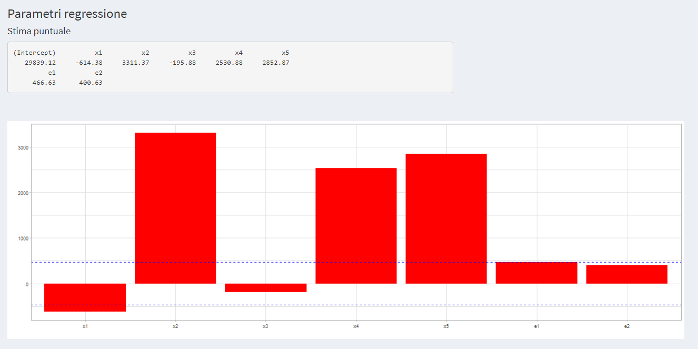
```

Come detto, le 2 variabili dummy possono essere usate come benchmark di significatività. Quindi tutti i parametri che in valore assoluto sono minori del valore assoluto dei coefficienti delle 2 variabili dummy possono essere considerati non significativi. In Figura \@ref(fig:pb5) sono tracciate 2 linee orizzontali indicanti la fascia di non significatività. La variabile $x_4$ (Tempo miscelazione, misurata in sec) è non significativa.

Lo studio può continuare raffinando l’indagine con un nuovo piano di esperimenti che prenda in esame solo questi 4 fattori significativi.

```{r pb4, echo=FALSE, fig.align='center',fig.pos='ht',fig.cap='Plot alias',out.width="100%"}
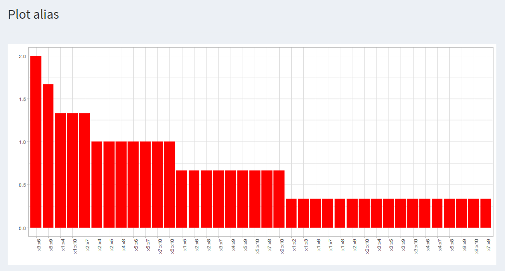
```
