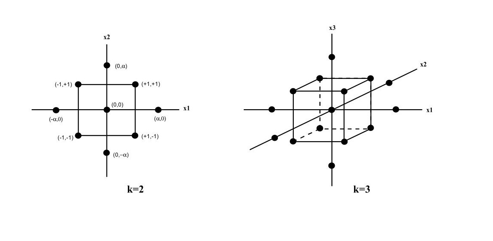
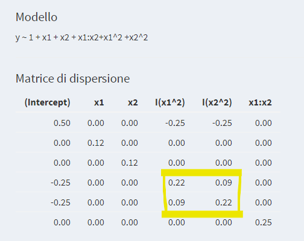
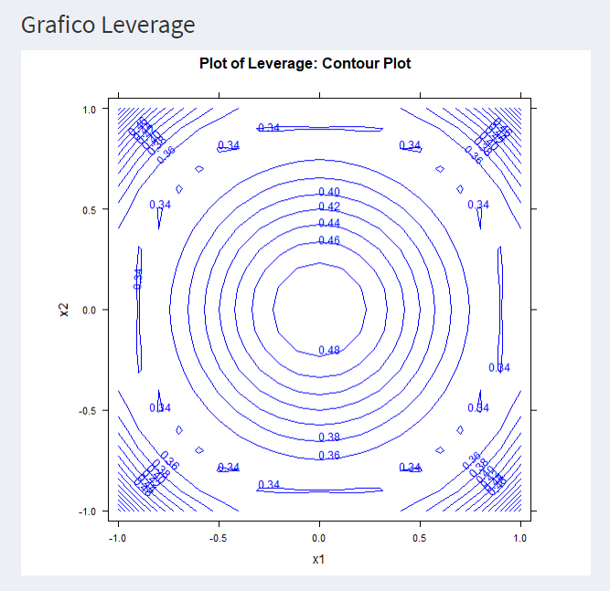

# Central Composite Design


```{r include=FALSE}
load("Dati/CCD.RData")
```

I disegni fattoriali completi, frazionari e Plackett-Burman sono utili per lo screening dei fattori e delle loro eventuali interazioni che abbiano effetto su un fenomeno analizzato.   
In questo capitolo siamo interessati al problema dell'ottimizzazione della variabile risposta nel dominio sperimentale. In termini analitici, per fissare le idee, ciò significa verificare se la risposta sperimentale ha massimi o minimi. Quindi, per gli studi di ottimizzazione, generalmente, bisogna analizzare la forma della superficie di risposta e verificare se essa ha una curvatura.   
Per superficie di risposta intendiamo la superficie descritta dalla funzione $f$, funzione teorica che descrive il fenomeno studiato
$$
    y=f(X_1,\dots,X_k),
$$
dove $X_1,\dots,X_k$ sono i fattori che influenzano il fenomeno studiato. La risposta sarà quindi
$$
    Y=f(X_1,\dots,X_k)+\epsilon,
$$
dove $\epsilon$ rappresenta l'errore sulla risposta osservata.

Ricordando che, poichè ogni funzione $f$ passante per un punto $\underline{x}_0=(x_{01},\dots,x_{0k})$ di $\mathbb{R}^k$ sufficientemente regolare (ossia differenziabile un numero sufficiente di volte in un intorno di $\underline{x}_0$) è approssimabile (formula di Taylor) da un polinomio $P_m$ di grado $m$
$$
    f(\underline{x})=P_m(\underline{x})+R(\underline{x}), \qquad \underline{x} \in \mathbb{R}^k
$$
dove
$$
    \lim_{\underline{x} \to \underline{x}_0}
    \frac{R(\underline{x})}{\|\underline{x}-\underline{x}_0 \|^m}=0,
$$
è sufficiente approssimare la risposta con un modello quadratico (posto $\underline{x}_0=0$)
$$
     Y=\beta_0+\beta_1 X_1+\cdots +\beta_k X_k +
    \beta_{12}X_1X_2+\cdots+\beta_{k-1, k}X_{k-1}  X_k+
    \beta_{11}X_1^2+\cdots+\beta_{kk}X_k^2+\epsilon 
$$

Si osservi che nell'uso dei disegni fattoriali completi, frazionari e di Plackett-Burman  abbiamo approssimato la superficie risposta con un piano descritto dal modello lineare contenente solo gli effetti principali dei fattori e abbiamo analizzato le "deformazioni" di questo piano dovute alle interazione tra fattori aggiungendo i termini di interazione a due termini nel modello lineare.

I domini sperimentali considerati in questi disegni non sono adatti ai modelli quadratici in quanto la relativa matrice di informazione non è invertibile, perché le colonne della matrice modello corrispondenti ai termini quadratici coincidono con la colonna *Int.*. Se la matrice di informazione non è invertibile, non esiste matrice di dispersione e non è possibile stimare i coefficienti del modello. 

Per ovviare a questo problema Box e Wilson hanno proposto un disegno fattoriale completo a cui vanno aggiunti $N$ punti centrali e $2k$ punti stellati, ossia per ogni fattore $X_j$ consideriamo i punti $(0,\dots,0,a,0,\dots,0)$ e $(0,\dots,0,-a,0,\dots,0)$  lungo l'asse $X_j$, con $a>1$. Per ogni fattore sono considerati $5$ livelli.  
Otteniamo così un disegno, chiamato disegno composito centrale e indicato con CCD, di $2^k+2k+N$ punti.  
Esempio di un CCD per $k=2,3$ e $a>1$ è rappresentato in Figura \@ref(fig:ccd1).

```{r ccd1, echo=FALSE, fig.align='center', fig.cap='Rappresentazione grafica del posizionamento dei punti stella in CCD', fig.pos='ht', out.width="100%"}

```

La matrice di tali disegni è data dalla matrice in Tabella \@ref(tab:MatrDisCCD)

+-------------+-------------+-------------+-------------+-------------+
|             | $\bf{X_1}$  | $\bf{X_2}$  | $\cdots$    | $\bf{X_k}$  |
+:===========:+:===========:+:===========:+:===========:+:===========:+
| 1           | -1          | -1          | $\cdots$    | -1          |
+-------------+-------------+-------------+-------------+-------------+
| 2           | 1           | -1          | $\cdots$    | -1          |
+-------------+-------------+-------------+-------------+-------------+
| 3           | -1          | 1           | $\cdots$    | -1          |
+-------------+-------------+-------------+-------------+-------------+
| 4           | 1           | 1           | $\cdots$    | -1          |
+-------------+-------------+-------------+-------------+-------------+
| $\cdot$     | $\cdot$     | $\cdot$     | $\cdots$    | $\cdot$     |
+-------------+-------------+-------------+-------------+-------------+
| $\cdot$     | $\cdot$     | $\cdot$     | $\cdots$    | $\cdot$     |
+-------------+-------------+-------------+-------------+-------------+
| $\cdot$     | $\cdot$     | $\cdot$     | $\cdots$    | $\cdot$     |
+-------------+-------------+-------------+-------------+-------------+
| $2^k$       | 1           | 1           | $\cdots$    | 1           |
+-------------+-------------+-------------+-------------+-------------+
|             |             |             |             |             |
+-------------+-------------+-------------+-------------+-------------+
| -1          | -a          | 0           | $\cdots$    | 1           |
+-------------+-------------+-------------+-------------+-------------+
| $\cdot$     | a           | 0           | $\cdots$    | 1           |
+-------------+-------------+-------------+-------------+-------------+
| $\cdot$     | $\cdot$     | $\cdot$     | $\cdots$    | $\cdot$     |
+-------------+-------------+-------------+-------------+-------------+
| $\cdot$     | $\cdot$     | $\cdot$     | $\cdots$    | $\cdot$     |
+-------------+-------------+-------------+-------------+-------------+
| $\cdot$     | $\cdot$     | $\cdot$     | $\cdots$    | $\cdot$     |
+-------------+-------------+-------------+-------------+-------------+
| $\cdots$    | 0           | 0           | $\cdots$    | -a          |
+-------------+-------------+-------------+-------------+-------------+
| $2^k+2k$    | 0           | 0           | $\cdots$    | a           |
+-------------+-------------+-------------+-------------+-------------+
|             |             |             |             |             |
+-------------+-------------+-------------+-------------+-------------+
| $2^k+2k+1$  | 0           | 0           | $\cdots$    | 0           |
+-------------+-------------+-------------+-------------+-------------+
| $\cdot$     | $\cdot$     | $\cdot$     | $\cdots$    | $\cdot$     |
+-------------+-------------+-------------+-------------+-------------+
| $\cdot$     | $\cdot$     | $\cdot$     | $\cdots$    | $\cdot$     |
+-------------+-------------+-------------+-------------+-------------+
| $\cdot$     | $\cdot$     | $\cdot$     | $\cdots$    | $\cdot$     |
+-------------+-------------+-------------+-------------+-------------+
| $2^k+2k+N$  | 0           | 0           | $\cdots$    | 0           |
+-------------+-------------+-------------+-------------+-------------+

: (\#tab:MatrDisCCD) Matrice disegno composito centrale

e la matrice relativa al modello quadratico è data dalla Tabella \@ref(tab:MatrModCCD).

+------------+--------+------------+------------+----------+------------+---------------+----------+---------+
|            | *Int.* | $\bf{X_1}$ | $\bf{X_2}$ | $\cdots$ | $\bf{X_k}$ | $\bf{X_1X_2}$ | $\cdots$ | $X^2_k$ |
+:==========:+:======:+:==========:+:==========:+:========:+:==========:+:=============:+:========:+:=======:+
| 1          | 1      | -1         | -1         | $\cdots$ | -1         | 1             | $\cdots$ | 1       |
+------------+--------+------------+------------+----------+------------+---------------+----------+---------+
| 2          | 1      | 1          | -1         | $\cdots$ | -1         | -1            | $\cdots$ | 1       |
+------------+--------+------------+------------+----------+------------+---------------+----------+---------+
| 3          | 1      | -1         | 1          | $\cdots$ | -1         | -1            | $\cdots$ | 1       |
+------------+--------+------------+------------+----------+------------+---------------+----------+---------+
| 4          | 1      | 1          | 1          | $\cdots$ | -1         | 1             | $\cdots$ | 1       |
+------------+--------+------------+------------+----------+------------+---------------+----------+---------+
| $\cdot$    | 1      | $\cdot$    | $\cdot$    | $\cdots$ | $\cdot$    | $\cdot$       | $\cdots$ | $\cdot$ |
+------------+--------+------------+------------+----------+------------+---------------+----------+---------+
| $\cdot$    | 1      | $\cdot$    | $\cdot$    | $\cdots$ | $\cdot$    | $\cdot$       | $\cdots$ | $\cdot$ |
+------------+--------+------------+------------+----------+------------+---------------+----------+---------+
| $\cdot$    | 1      | $\cdot$    | $\cdot$    | $\cdots$ | $\cdot$    | $\cdot$       | $\cdots$ | $\cdot$ |
+------------+--------+------------+------------+----------+------------+---------------+----------+---------+
| $2^k$      | 1      | 1          | 1          | $\cdots$ | 1          | 1             | $\cdots$ | 1       |
+------------+--------+------------+------------+----------+------------+---------------+----------+---------+
|            |        |            |            |          |            |               |          |         |
+------------+--------+------------+------------+----------+------------+---------------+----------+---------+
| -1         | 1      | -a         | 0          | $\cdots$ | 1          | 0             | $\cdots$ | 1       |
+------------+--------+------------+------------+----------+------------+---------------+----------+---------+
| $\cdot$    | 1      | a          | 0          | $\cdots$ | 1          | 0             | $\cdots$ | 1       |
+------------+--------+------------+------------+----------+------------+---------------+----------+---------+
| $\cdot$    | 1      | $\cdot$    | $\cdot$    | $\cdots$ | $\cdot$    | $\cdot$       | $\cdots$ | $\cdot$ |
+------------+--------+------------+------------+----------+------------+---------------+----------+---------+
| $\cdot$    | 1      | $\cdot$    | $\cdot$    | $\cdots$ | $\cdot$    | $\cdot$       | $\cdots$ | $\cdot$ |
+------------+--------+------------+------------+----------+------------+---------------+----------+---------+
| $\cdot$    | 1      | $\cdot$    | $\cdot$    | $\cdots$ | $\cdot$    | $\cdot$       | $\cdots$ | $\cdot$ |
+------------+--------+------------+------------+----------+------------+---------------+----------+---------+
| $\cdots$   | 1      | 0          | 0          | $\cdots$ | -a         | 0             | $\cdots$ | 1       |
+------------+--------+------------+------------+----------+------------+---------------+----------+---------+
| $2^k+2k$   | 1      | 0          | 0          | $\cdots$ | a          | 0             | $\cdots$ | 1       |
+------------+--------+------------+------------+----------+------------+---------------+----------+---------+
|            |        |            |            |          |            |               |          |         |
+------------+--------+------------+------------+----------+------------+---------------+----------+---------+
| $2^k+2k+1$ | 1      | 0          | 0          | $\cdots$ | 0          | 0             | $\cdots$ | 1       |
+------------+--------+------------+------------+----------+------------+---------------+----------+---------+
| $\cdot$    | 1      | $\cdot$    | $\cdot$    | $\cdots$ | $\cdot$    | $\cdot$       | $\cdots$ | $\cdot$ |
+------------+--------+------------+------------+----------+------------+---------------+----------+---------+
| $\cdot$    | 1      | $\cdot$    | $\cdot$    | $\cdots$ | $\cdot$    | $\cdot$       | $\cdots$ | $\cdot$ |
+------------+--------+------------+------------+----------+------------+---------------+----------+---------+
| $\cdot$    | 1      | $\cdot$    | $\cdot$    | $\cdots$ | $\cdot$    | $\cdot$       | $\cdots$ | $\cdot$ |
+------------+--------+------------+------------+----------+------------+---------------+----------+---------+
| $2^k+2k+N$ | 1      | 0          | 0          | $\cdots$ | 0          | 0             | $\cdots$ | 1       |
+------------+--------+------------+------------+----------+------------+---------------+----------+---------+

: (\#tab:MatrModCCD) Matrice modello

Con un po' di calcolo si ottiene la matrice di informazione data in Tabella \@ref(tab:MatrInfoCCD).  
Si osservi che la correlazione tra i termini lineari e interazioni è nulla (parte dovuta al disegno fattoriale completo $2^k$) così come interazione tra i termini lineari e interazione con i termini di secondo grado (questo implica che i termini lineari ''leggono'' correttamente la crescita o la decrescita della risposta) mentre in generale non è nulla la correlazione tra termini quadratici e i termini quadratici e intercetta.

|                   |   *Int.*   | $\bf{X_1}$ | $\cdots$ | $\bf{X_k}$ | $\bf{X_1X_2}$ | $\cdots$ | $\bf{X_{k-1}X_k}$ |     | $\bf{X_1^2}$ | $\cdots$ | $\bf{X_k^2}$ |
|:-----------------:|:----------:|:----------:|:--------:|:----------:|:-------------:|:--------:|:-----------------:|:---:|:------------:|:--------:|:------------:|
|       *Int.*      | $2^k+2k+N$ |      0     | $\cdots$ |      0     |       0       | $\cdots$ |         0         |     |  $2^k+2a^2$  | $\cdots$ |  $2^k+2a^2$  |
|     $\bf{X_1}$    |      0     | $2^k+2a^2$ | $\cdots$ |      0     |       0       | $\cdots$ |         0         |     |       0      | $\cdots$ |       0      |
|      $\cdot$      |   $\cdot$  |   $\cdot$  | $\cdots$ |   $\cdot$  |    $\cdot$    | $\cdots$ |      $\cdot$      |     |    $\cdot$   | $\cdots$ |    $\cdot$   |
|      $\cdot$      |   $\cdot$  |   $\cdot$  | $\cdots$ |   $\cdot$  |    $\cdot$    | $\cdots$ |      $\cdot$      |     |    $\cdot$   | $\cdots$ |    $\cdot$   |
|      $\cdot$      |   $\cdot$  |   $\cdot$  | $\cdots$ |   $\cdot$  |    $\cdot$    | $\cdots$ |      $\cdot$      |     |    $\cdot$   | $\cdots$ |    $\cdot$   |
|     $\bf{X_k}$    |      0     |      0     | $\cdots$ | $2^k+2a^2$ |       0       | $\cdots$ |         0         |     |       0      | $\cdots$ |       0      |
|   $\bf{X_1X_2}$   |      0     |      0     | $\cdots$ |      0     |     $2^k$     | $\cdots$ |         0         |     |       0      | $\cdots$ |       0      |
|      $\cdot$      |   $\cdot$  |   $\cdot$  | $\cdots$ |   $\cdot$  |    $\cdot$    | $\cdots$ |      $\cdot$      |     |    $\cdot$   | $\cdots$ |    $\cdot$   |
|      $\cdot$      |   $\cdot$  |   $\cdot$  | $\cdots$ |   $\cdot$  |    $\cdot$    | $\cdots$ |      $\cdot$      |     |    $\cdot$   | $\cdots$ |    $\cdot$   |
|      $\cdot$      |   $\cdot$  |   $\cdot$  | $\cdots$ |   $\cdot$  |    $\cdot$    | $\cdots$ |      $\cdot$      |     |    $\cdot$   | $\cdots$ |    $\cdot$   |
| $\bf{X_{k-1}X_k}$ |      0     |      0     | $\cdots$ |      0     |       0       | $\cdots$ |       $2^k$       |     |       0      | $\cdots$ |       0      |
|                   |            |            |          |            |               |          |                   |     |              | $\cdots$ |              |
|    $\bf{X_1^2}$   | $2^k+2a^2$ |      0     | $\cdots$ |      0     |       0       | $\cdots$ |         0         |     |  $2^k+2a^4$  | $\cdots$ |     $2^k$    |
|      $\cdot$      |   $\cdot$  |   $\cdot$  | $\cdots$ |   $\cdot$  |    $\cdot$    | $\cdots$ |      $\cdot$      |     |    $\cdot$   | $\cdots$ |    $\cdot$   |
|      $\cdot$      |   $\cdot$  |   $\cdot$  | $\cdots$ |   $\cdot$  |    $\cdot$    | $\cdots$ |      $\cdot$      |     |    $\cdot$   | $\cdots$ |    $\cdot$   |
|      $\cdot$      |   $\cdot$  |   $\cdot$  | $\cdots$ |   $\cdot$  |    $\cdot$    | $\cdots$ |      $\cdot$      |     |    $\cdot$   | $\cdots$ |    $\cdot$   |
|    $\bf{X_k^2}$   | $2^k+2a^2$ |      0     | $\cdots$ |      0     |       0       | $\cdots$ |         0         |     |       0      | $\cdots$ |  $2^k+2a^4$  |

: (\#tab:MatrInfoCCD) Matrice informazione $X^tX$


Nei CCD, per qualsiasi numero *k* di fattori, devono essere specificati necessariamente ogni volta anche $2$ parametri geometrici del disegno: la distanza assiale $a$ dal centro e il numero $N$ di punti centrali. La scelta di questi parametri dipende dalle proprietà che si desidera siano soddisfatte dal CCD.

**Ruotabilità - Piano ruotabile** - tutte le risposte ottenuti da esperimenti che giacciono su una sfera centrata nel centro sono stimate con la stessa approssimazione e hanno lo stesso valore di Leverage. Ossia $Var(\hat{y})$ e Leverage dipendono solo dalla distanza dal centro.   
Per
$$
    a=\sqrt[4]{2^k}
$$
otteniamo un CCD ruotabile.


**Sfericità - Piano a simmetria sferica** - il disegno è inserito in una sfera centrata nel centro e raggio $\sqrt{k}$. \newline
Per
$$
    a=\sqrt{k}
$$
otteniamo un CCD sferico. \newline
Si noti che per $k=2$ le proprietà di ruotabilità e di sfericità coincidono.


**Ortogonalità - Piano ortogonale** - un CCD è detto ortogonale quando i termini quadratici sono ortogonali tra loro, ossia la correlazione tra termini quadratici è nulla (da non confondere con l'ortogonalità del modello in cui si richiede l'ortogonalità tra tutti i termini, intercetta compresa).  
Per
$$
    a^2=\frac{\sqrt{(2^k+2k+N)2^k}-2^k}{2}\label{eq:CCDOrt}
$$
otteniamo un CCD ortogonale.

**Facce centrate** - nel caso in cui la regione dello spazio in cui variano i fattori di interesse sia un cuboide, è possibile aumentare il dominio del piano fattoriale completo scegliendo i punti centrali delle facce del cuboide con
$$
a=1
$$
Un caso particolare interessante è quello per k=2: il CCD a facce centrate è identico al piano fattoriale completo $3^2$.


## Esempio
Consideriamo la resa $Y_1$ di una reazione chimica che dipende da $2$ fattori: il tempo della reazione $X_1$ e la temperatura $X_2$ (cf.[@DesAnExp, Ex 11.2]).
Siamo interessati a massimizzare la resa $Y_1$ sotto alcune condizioni (vincoli) sulla viscosità $Y_2$ e il peso molecolare $Y_3$ del prodotto. Siamo interessati al seguente problema
\begin{eqnarray*}
% \nonumber to remove numbering (before each equation)
  \rm{Max} & Y_1 \\
  \rm{sub}  & 62\leq Y_2 \leq 68 \quad \\
                 & \quad Y_3 \leq 3400.
\end{eqnarray*}
Per affrontare il problema costruiamo un CCD con $k=2, a=\sqrt{2}$ e $N=2$. Per quanto visto è un disegno sferico, ruotabile non ortogonale.

Il dominio sperimentale con i valori autentici dei fattori, il dominio sperimentale codificato e le risposte sono dati in Tabella \@ref(tab:esmatrmod).
\newpage

```{r esmatrmod, echo=FALSE}
knitr::kable(Es_Montgomery[1:10,],caption = 'Dominio sperimentale autentico, dominio sperimentale
codificato e risposte')
```

Nell'applicativo, nel menù *CCD* selezioniamo 2 fattori, 2 punti al centro e scegliamo un disegno di tipo sferico, Figura \@ref(fig:ccd2)
\newpage

```{r ccd2, echo=FALSE, fig.align='center',fig.pos='ht',fig.cap="Scelta numero fattori, punti al centro e tipo di CCD nell'applicativo",out.width="100%"}

```

Ognuna delle 3 risposte sarà analizzata con il modello quadratico Figura \@ref(fig:ccd3). Dalla lettura della matrice di dispersione si nota la non ortogonalità del modello (i termini quadratici sono correlati tra di loro, v. riquadro colorato in giallo nella Figura).

```{r ccd3, echo=FALSE, fig.align='center',fig.pos='ht',fig.cap='Modello e matrice di dispersione del CCD',out.width="100%"}

```

Le linee di livello del Leverage Figura \@ref(fig:ccd4) mettono in evidenza invece la ruotabilità del piano sperimentale scelto. 

```{r ccd4,echo=FALSE, fig.align='center',fig.pos='ht',fig.cap='Grafico delle linee di livello del Leverage',out.width="100%"}

```


Procediamo come di consueto inserendo le Risposte nell'apposito riquadro. Una volta convalidato il modello con tre misure indipendenti Tabella \@ref(tab:matrconv)
\newpage

```{r matrconv, echo=FALSE}
knitr::kable(Es_Montgomery[11:13,],caption = 'Misure indipendenti per convalidare il modello')
```


possiamo utilizzare il grafico delle linee di livello Figura \@ref(fig:ccd5) per confrontare le risposte tra di loro. 

```{r ccd5, echo=FALSE,fig.show = "hold", fig.align='default',fig.pos='ht',fig.cap='Grafico delle linee di livello delle risposte $Y_1,Y_2$ e $Y_3$', out.width = "50%"}
knitr::include_graphics(c("Immagini/CCD/05_liv1.png","Immagini/CCD/06_liv2.png","Immagini/CCD/07_liv3.png"))
```

Nell'applicativo si noti che è possibile scegliere il colore delle linee di livello. Questa risorsa è utile quando, come in questo caso, bisogna confrontare più grafici tra loro Figura \@ref(fig:ccd8).

```{r ccd8, echo=FALSE,fig.show='hold',fig.pos='ht',fig.cap='Grafici delle linee di livello delle risposte $Y_1,Y_2$ e $Y_3$ sovrapposti e regione di ottimo', out.width = "50%"}
knitr::include_graphics(c("Immagini/CCD/08_livelli.png","Immagini/CCD/09_livelli.png"))
```

Analizzando i vincoli e le linee di livello della resa $Y_1$ si vede che le zona in cui cercare soluzione del problema sono quelle colorate in grigio (v. Figura \@ref(fig:ccd8)).


