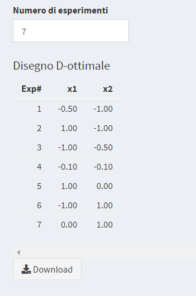

# Disegni D-ottimali


```{r include=FALSE}
load("Dati/D_opt.RData")
```

Nelle sezioni precedenti sono stati illustrati disegni in cui la geometria del dominio sperimentale (iperpiano, ipercubo, ipersfera) e il modello erano prefissati (modello primo ordine, lineare senza interazioni, di secondo ordine lineare con interazioni di coppie di termini, di secondo ordine con interazioni a coppie  e con termini quadratici). Questi piani sperimentali e i corrispondenti modelli sono "ottimali" e garantiscono la massima efficienza nella sperimentazione, vale a dire l'ottenimento della informazione di migliore qualità con il numero minimo di esperimenti possibile.
Tuttavia esistono molte situazioni in cui i disegni fino ad ora visti possono non essere la scelta "migliore". I casi più comuni in cui è difficile impiegare proficuamente i disegni canonici visti finora sono:

  + la regione sperimentale non è una figura geometrica regolare: si devono rispettare condizioni di lavoro prestabilite - vincoli;
  + il modello è non canonico: ad esempio contiene un termine quadratico in una variabile ma non nelle altre, oppure contiene fattori quantitativi e almeno un fattore qualitativo a più di due livelli (es. la regolazione di uno strumento è possibile solo su tre livelli non numerici indicati con "basso", "medio" e "alto")
  + il numero di esperimenti fattibili non è sufficiente per completare i disegni fino ad ora visti per qualsiasi ragione (es. indisponibilità di risorse, di tempo) .

In tutti questi casi, non è mai una buona decisione quella di adattare artificiosamente la sperimentazione ad un disegno sperimentale e ad un modello canonico. Piuttosto conviene pensare quali possono essere il modello e il piano sperimentale migliori per studiare il problema in osservazione.
La soluzione a questi problemi che proponiamo in questo corso e nell'applicativo è fornita dai cosiddetti *disegni D-ottimali*.
La costruzione dei disegni D-ottimali è condotta come segue.
Fissata la regione sperimentale da stusiare, scegliamo in tale regione un insieme di $m$ punti (leggi: esperimenti) candidati ad essere usati per costruire un disegno ad-hoc per il nostro problema. In generale si considera una griglia di punti che copre l'intera regione da studiare con un dettaglio (leggi: ampiezza degli intervalli che costituiscono la griglia dei punti sperimentali) che dipende dagli obiettivi dello studio.   
Si scelgono quindi un modello contenente $p$ parametri e il numero $n$
  \begin{equation*}
p \leq n \leq m
\end{equation*}
di esperimenti che vogliamo eseguire. Fatte queste scelte la matematica ci consente di sapere che esistono
\begin{equation*}
\frac{m!}{(m-n)!n!}
\end{equation*}
matrici sperimentali possibili. Per scegliere il "disegno migliore" tra queste $\frac{m!}{(m-n)!n!}$ matrici esistono vari criteri. In questa dispensa ci occuperemo del criterio cosiddetto di *$D$-ottimalità* e di quei disegni, definiti per questo *D-ottimali*, che soddisfano tale criterio di scelta. Tali disegni sono quelli che massimizzano il determinante della matrice di informazione.
\begin{equation*}
\rm{det}(X^tX).
\end{equation*}
Maggiore è il determinante della matrice di informazione "migliore" è l'ortogonalità del modello. Si può dimostrare che la radice del determinate della matrice di informazione è inversamente proporzionale al volume dell'iperelissoide di confidenza dei parametri del modello. Massimizzare il determinante della matrice di informazione corrisponde a rendere di migliore qualità l'informazione sui parametri del modello (i.e. rendere minima la loro varianza) e  ottenere quindi la predizione più precisa della variabile risposta.\newline
I disegni canonici fino ad ora considerati sono tutti $D$-ottimali.

Per poter confrontare disegni che differiscono per il numero di esperimenti progettati $n$ (ad esempio, un disegno non canonico in cui è possibile avere più repliche di esperimenti nel dominio sperimentale) introduciamo il seguente indicatore $0 \leq D \leq 1$
\begin{equation}
    D=\frac{\rm{det}(X^tX)^{1/p}}{n}
    (\#eq:DOpt)
\end{equation}
che misura la "qualità" del disegno considerato. Si noti che in generale per piani sperimentali multivariati non è vero che all'aumentare di $n$ abbiamo una migliore "qualità" del disegno (cf. Figura \@ref(fig:fig3)). Questo criterio vale solo per studi limitati alla misura dell'effetto di un solo fattore. L'indicatore $D$ trova il miglior compromesso tra maggiore informazione (determinante della matrice di informazione) e lo "sforzo" sperimentale (il numero $n$ di esperimenti).\newline
Indicando rispettivamente con $D_1$ e $D_2$ l'indicatore (\ref{eq:DOpt}) per un piano sperimentale costruito con un disegno avente numero di esperimenti differenti $n_1$ e $n_2$, l'efficacia relativa tra i due progetti si ottiene del rapporto $D_1/D_2$.


## Algoritmo di Federov
Descriviamo brevemente l'algoritmo di Federov, su cui è basato l'applicativo, per determinare disegni $D$-ottimali.    

Sia $X_n$ la matrice del modello di un disegno di $n$ esperimenti. Indichiamo con $X_{n+1}$ la matrice del modello del disegno di $n+1$ punti sperimentali ottenuta aggiungendo a $X_n$ un nuovo punto $x^j$. La corrispondente matrice di informazione è data
\begin{equation*}
    X^t_{n+1}X_{n+1}=X^t_nX_n+(x^j*x^{jt})
\end{equation*}
il cui determinante soddisfa
\begin{equation*}
    \rm{det}(X^t_{n+1}X_{n+1})=\rm{det}(X^t_nX_n)(1+h(x^j)),
\end{equation*}
dove $h(x^j)=x^j(X^t_nX_n){-1}x^{jt}$ è il valore Leverage di $x^j$. \newline
In maniera analoga, indicando con $X_{n-1}$ la matrice del modello del  disegno di $n-1$ punti sperimentali ottenuto rimuovendo da $X_n$ un punto $x_i$, la corrispondente matrice di informazione è data
\begin{equation*}
    X^t_{n-1}X_{n-1}=X^t_nX_n+(x_i*x^t_i)
\end{equation*}
il cui determinante soddisfa
\begin{equation*}
    \rm{det}(X^t_{n-1}X_{n-1})=\rm{det}(X^t_nX_n)(1-h(x_i)),
\end{equation*}
dove $h(x_i)=x_i(X^t_nX_n)^{-1}x^t_i$ è il valore Leverage di $x_i$.

Nell'algoritmo di Federov lo scambio tra un punto sperimentale $x^j$ appartenete all'insieme dei punti candidati e un punto $x_i$ appartenente al disegno iniziale avviene simultaneamente ottenendo un nuovo disegno la cui matrice del modello $\tilde{X}_n$ ha la corrispondente matrice di informazione legata alla precedente da
\begin{equation*}
    \tilde{X_n}^t\tilde{X_n}=X^t_{n}X_{n}-(x_i*x_i^t)+(x^j*x^{jt})
\end{equation*}
il cui determinante soddisfa
\begin{equation*}
    \rm{det}(\tilde{X_n}^t\tilde{X_n})=\rm{det}(X^t_{n}X_{n})(1+\Delta(x_i,x^j)),
\end{equation*}
dove
\begin{equation*}
    \Delta(x_i,x^j)=h(x^j)-(h(x_i)h(x^j)-h(x_i,x^j)^2)-h(x_i)
\end{equation*}
con $h(x_i,x^j)=x_i^t(X^tX)x^j=x^j(X^tX)x_i.$

L'algoritmo di Federov sceglie casualmente $n$ punti nell'insieme dei punti candidati, ne calcola la matrice del modello $X$ e quindi determina il valore $\Delta(x_i,x^j)$ per ogni coppia di $(x_i,x^j)$ con $x_i$ appartenente al disegno scelto casualmente e $x^j$ appartenente all'insieme dei punti candidati (esclusi gli $n$ punti scelti). La procedura di calcolo individua una coppia di esperimenti $(x_i,x^j)$ per cui $\Delta(x_i,x^j)$ sia positivo e massimo e quindi scambia $x_i$ con $x^j$. A partire dal nuovo insieme di $n$ punti ripete il procedimento finché non trova una coppia di punti $(x_i,x^j)$ con $\Delta(x_i,x^j)>0$. Nei vari software di calcolo il procedimento si ferma quando $\Delta(x_i,x^j)$ raggiunge un valore sufficientemente piccolo.

## Esempio: proprietà di un adesivo
Uno sperimentatore sta indagando sulle proprietà di un
particolare adesivo termoplastico. L’adesivo è applicato su due parti di pezzi che vengono incollati tra loro e quindi trattati a temperature diverse. I
due fattori di interesse sono 

+ $X_1$ la quantità di adesivo applicato
+ $X_2$ la temperatura.

La variabile risposta $Y$ è la forza con cui le due parti di ogni pezzo risultano incollate, misurata dalla cosiddetta "forza di strappo". Questa risposta è descritta con un modello del secondo ordine
$$
Y=b_0+b_1X_1+b_2X_2+b_{11}X_1^2+b_{22}X_2^2+b_{12}X_1X_2
$$

Considerando il dominio standardizzato, le variabili $X_1$ e $X_2$ variano tra $-1$ e $1$. Lo sperimentatore sa che se viene applicato troppo poco adesivo e la temperatura è troppo bassa, le parti non si incollano. Si impone quindi il vincolo
$$
X_1+X_2\geq-1.5
$$
Inoltre, se la temperatura del trattamento termico è troppo alta e si applica troppo adesivo, le parti incollate si rovinano per effetto di stress da calore, oppure non si incollano bene. Si impone quindi anche un secondo vincolo
$$
X_1+X_2\leq 1
$$

Scegliamo nella regione sperimentale un insieme di punti candidati ad essere usati per un disegno. Stabiliamo ad esempio di usare una griglia di passo 0.1. Per generare la matrice dei punti candidati nell'applicativo, si seleziona il menù D-ottimale alla pagina Matrice punti candidati, e si scelgono le opzioni del caso in esame come in Figura \@ref(fig:fig1)

```{r fig1, echo=FALSE, fig.align='center',fig.pos='ht',fig.cap='Costruzione della matrice dei punti candidati',out.width="100%"}
knitr::include_graphics("Immagini/D_opt/01_es1_pticandidati.png")
```

Si noti come sono stati indicati i vincoli. Se si vuole, è possibile scaricare la matrice dei punti candidati generata con il tasto Download. In Figura \@ref(fig:fig2) è illustrata graficamente la forma del dominio sperimentale dei punti del caso in discussione, realizzata con Excel.

```{r fig2, echo=FALSE, fig.align='center',fig.pos='ht',fig.cap='Insieme dei punti candidati',out.width="100%"}
knitr::include_graphics("Immagini/D_opt/02_es1_pticandidati.png")
```

Nella pagina D-ottimale Figura \@ref(fig:fig3) una volta fissato il modello e il numero massimo di esperimenti, cliccando sul bottone Calcola viene determinato il piano sperimentale D-ottimale per ogni numero di esperimenti tra il minimo e il massimo fissati nell'applicativo. Sono anche dati i valori del parametro $D$ definito in \@ref(eq:DOpt) e il valore di VIF massimo. Possiamo vedere l'andamento di questi valori in funzione del numero di esperimenti in Figura \@ref(fig:fig3) 

```{r fig3, echo=FALSE, fig.pos='ht',fig.show = "hold",fig.cap='Andamento del parametro $D$ e del VIF massimo in funzione del numero di esperimenti',out.width="50%"}
knitr::include_graphics(c("Immagini/D_opt/04_es1_pticandidati.png","Immagini/D_opt/05_es1_pticandidati.png"))
```

Come si può vedere in Figura \@ref(fig:fig3) il "migliore" valore di $D$ è dato dal piano con 7 esperimenti Figura \@ref(fig:fig6) e Figura \@ref(fig:fig7)

```{r fig6, echo=FALSE, fig.align='center',fig.pos='ht',fig.cap='Disegno D-ottimale',out.width="100%"}

```
```{r fig7, echo=FALSE, fig.align='center',fig.pos='ht',fig.cap='Disegno D-ottimale',out.width="100%"}
knitr::include_graphics("Immagini/D_opt/07_es1_pticandidati.png")
```


## Esempio: riparazione di una matrice
I disegni D-ottimali possono essere usati per “riparare” matrici i cui gli esperimenti sono stati eseguiti senza seguire un piano sperimentale predeterminato
definendo l'insieme degli esperimenti possibili (insieme dei punti candidati) e tenendo “bloccati” gli esperimenti già eseguiti. 
Vediamo un esempio.

Per ottimizzare un metodo cromatografico [@r.leardi2018] è stato utilizzato un CCD a facce centrate con 4 variabili e 5 repliche al centro per un totale di 29 esperimenti.
Dopo che ci si è resi conto che il livello superiore di $X_3$ era troppo alto (tutti i 9 esperimenti eseguiti con $X_3$ = 1 sono falliti). Non era più possibile avere sufficiente informazione dai 16 esperimenti “buoni” di cui 1 replicato 5 volte (punti al centro).  
Fu deciso di tenere il precedente livello inferiore di $X_3$ ma di utilizzare il livello centrale del primo piano di esperimenti come nuovo livello superiore e di fissare un nuovo livello centrale nel punto medio dei due nuovi livelli Tabella \@ref(tab:Esbuoni)


```{r Esbuoni, echo=FALSE}
knitr::kable(Es2,caption = 'I 16 esperimenti "buoni" di cui 1 replicato 5 volte',booktabs = TRUE)
```

Gli esperimenti possibili tra cui scegliere i punti da introdurre nel piano sperimentale da "aggiustare" sono tutti i $3^4$ esperimenti possibili con $4$ fattori studiati a $3$ livelli (-1,0,1), e da questi vanno tolti i 16 esperimenti già eseguiti. Per costruire l'insieme di tutte le combinazioni dei 4 fattori con l'applicativo nella pagina Matrice punti candidati del menù D-ottimale si indicano i livelli per ogni variabile come in Figura \@ref(fig:fig10)

```{r fig10, echo=FALSE, fig.align='center',fig.pos='ht',fig.cap='Costruzione dei punti candidati indicando i livelli',out.width="100%"}
knitr::include_graphics("Immagini/D_opt/10_es2.png")
```

Una volta "ripulito" il dataset creato dai 16 esperimenti già eseguiti lo si importa nella pagina Matrice punti candidati. Quindi si importano nella pagina D-ottimale per aggiunta i 16 esperimenti già eseguiti e, una volta fissati il numero minimo e massimo di esperimenti totali (20 già eseguiti: 16 più 5 repliche, quindi almeno 21), cliccando sul bottone Calcola si ottiene il piano sperimentale D-ottimale. L'operazione è condotta seguendo la stessa logica descritta per la pagina D-ottimale, Figura \@ref(fig:fig8)

```{r fig8, echo=FALSE, fig.pos='ht',fig.show = "hold",fig.cap='Andamento del parametro $D$ e VIF max in funzionedel Numero di esperimenti',out.width="50%"}
knitr::include_graphics(c("Immagini/D_opt/08_es2.png","Immagini/D_opt/09_es2.png"))
```

Nell'esempio in discussione, il compromesso scelto fu quello di aggiungere 11 esperimenti ai 20 già eseguiti. La soluzione detta fu adottata considerando il basso costo di ogni esperimento. Come spesso accade però nelle analisi di esperimenti condotte *a posteriori*, se si riconsidera il problema più attentamente, si può osservare che aggiungendo un solo esperimento si ottiene una soluzione più che accettabile.

Nota: l'algoritmo di Federov è conosciuto da oltre 40 anni ed è uno degli algoritmi più studiati per calcoli di disegni D-ottimali [@v.v.federov1972]. Negli anni, molti studiosi hanno sviluppato varianti di questo algoritmo presentate come più veloci ed efficienti, per cui usando sofware commerciali (es. Minitab, Design Expert, JMP) può capitare di dovere scegliere tra più opzioni di metodi per il calcolo di piani sperimentali ottimali. In questi software, l'algoritmo di Federov originale è chiamato "algoritmo di scambio", e le versioni modificate fanno ricorso a sistemi meno laboriosi dal punto di vista del calcolo per la scelta dei punti su cui eseguire lo scambio descritto in questa sezione.


