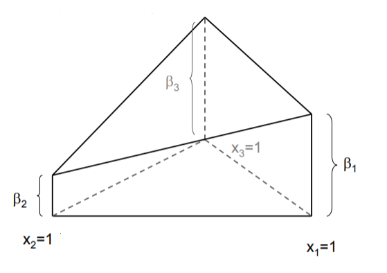
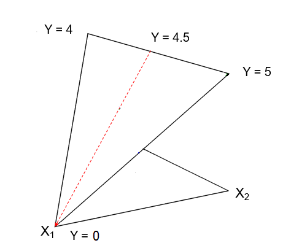
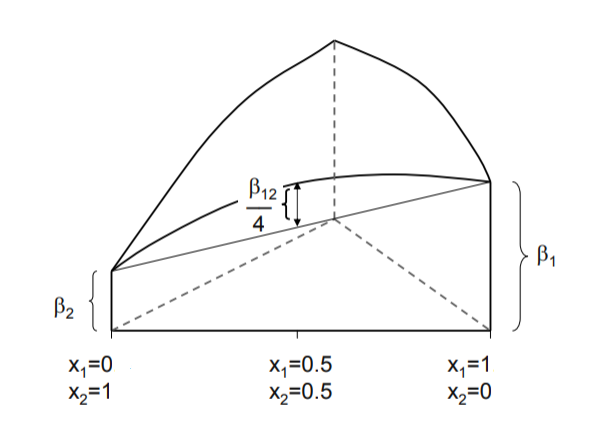
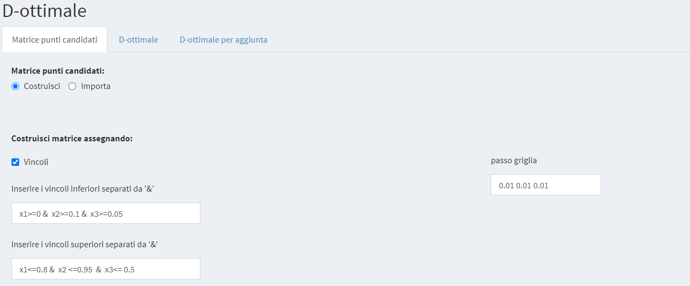
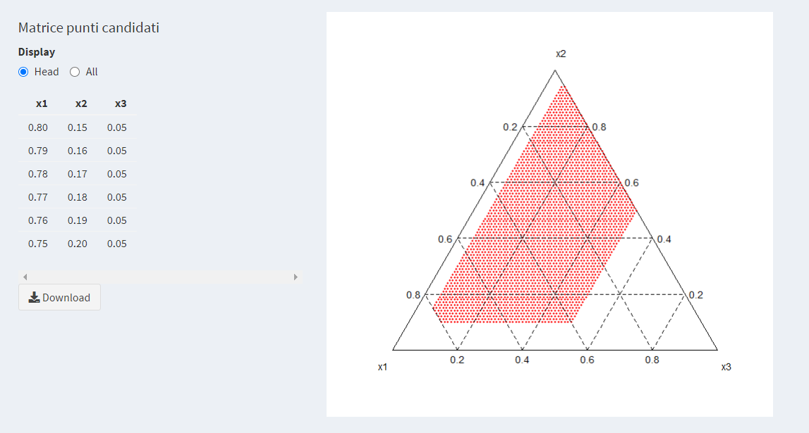
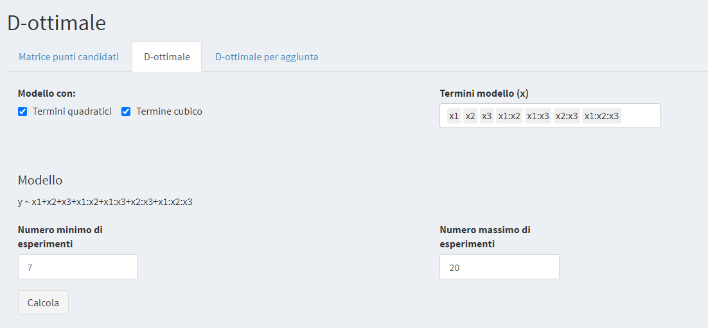
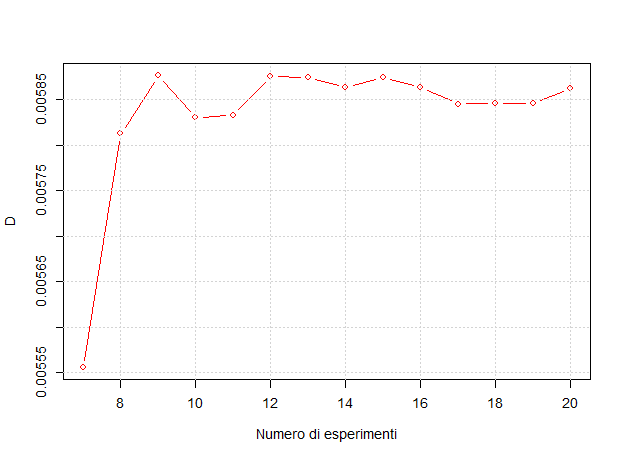
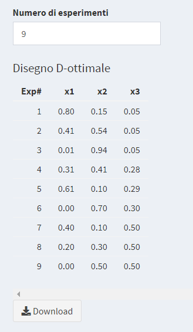

# Miscele


```{r include=FALSE}
load("Dati/Mixt.RData")
```

In un esperimento con miscele i $k$ fattori $X_1, \dots, X_k$ sono le differenti proporzioni dei costituenti della miscela, e queste devono soddisfare il seguente vincolo
 \begin{equation}
    X_1+\cdots+X_k=1.
    (\#eq:VinMisc)
 \end{equation}
Il fatto che la somma delle proporzioni dei differenti fattori debba essere uguale a $1$ complica il disegno sperimentale e l'analisi dei risultati. Il dominio sperimentale può avere forma geometrica regolare (triangolare $\mathbb{R}^2$}, tetraedrica in $\mathbb{R}^3$}, ipertetraedrica in $\mathbb{R}^k$}), oppure poligonale o iperpoliedrica irregolare se le proporzioni stesse sono condizionate da vincoli particolari.
Nel caso caso di $3$ fattori si può rappresentare bidimensionalmente il dominio sperimentale mediante un diagramma ternario (vedi Figura \@ref(fig:MiscDiaTern))

```{r MiscDiaTern, echo=FALSE, fig.cap="Diagramma ternario ($p=(20,40,40)$)", message=FALSE, warning=FALSE}
library(ggtern)
ggtern()+
  geom_point(data=data.frame(X1=0.2,X2=0.4,X3=0.4),aes(X1,X2,X3),
             colour="red",size=2)+
  theme_rgbg()
```

in cui è rappresentato il punto di coordinate $p=(0.2,0.4,0.4)$. Si noti che in Figura \@ref(fig:MiscDiaTern) le coordinate sono date in percentuale e non in proporzione, ossia $p=(20,40,40)$.

In questo dominio dovremo ricavare, mediante opportuno disegno sperimentale, l'ottimo della risposta e conoscere come varia la risposta nel dominio sperimentale.
Oltre a questo vincolo primario possono esserci ulteriori vincoli e ciò complica ancora di più la situazione.

Consideriamo ora i modelli per disegni di miscele. Non tutti i modelli utilizzati fino ad ora potranno essere definiti in quanto per alcuni di essi la relativa matrice d'informazione non è invertibile per l'esistenza del vincolo \@ref(eq:VinMisc) che rende non indipendenti tra loro i fattori del disegno. 
Ad esempio l'usuale modello del primo ordine
\begin{equation*}
    Y=\beta_0+\sum_{i=1}^k\beta_iX_i+\epsilon
\end{equation*}
ha matrice d'informazione singolare essendo per il vincolo (\ref{eq:VinMisc}) la colonna *Int.* somma delle colonne $X_1,\dots,X_k$. Si può pensare di eliminare uno dei fattori ponendo che ad es. $X_j=1-\sum_{i\neq j}X_i$ ma il migliore approccio è stato finora quello suggerito da Sheffé. La soluzione proposta da Sheffé fu  di moltiplicare $\beta_0$ per $1=\sum_iX_i$ per ottenere
\begin{equation*}
    Y=\sum_{i=1}^k(\beta_0+\beta_i)X_i+\epsilon.
\end{equation*}
Analogamente l'usuale modello quadratico
\begin{equation*}
    Y=\sum_{i=1}^k\beta_iX_i+\sum_{i=1}^k\sum_{j>i}\beta_{ij}X_iX_j+\sum_{i=1}^k\beta_{ii}X_i^2+
    \epsilon
\end{equation*}
ha matrice d'informazione singolare essendo per il vincolo \@ref(eq:VinMisc)
\begin{equation*}
    X_i^2=X_iX_i=X_i(1-\sum_{j\neq i}X_j)=X_i-\sum_{j\neq i}X_iX_j.
\end{equation*}
In questo caso si può eliminare
$X_i^2=X_i-\sum_{j\neq i}X_iX_j$ ottenendo
\begin{equation*}
    Y=\sum_{i=1}^k(\beta_i+\beta_{ii})X_i++\sum_{i=1}^k\sum_{j>i}(\beta_{ij}-\beta_{ii}-\beta_{jj})X_iX_j
    +\epsilon.
\end{equation*}
Ragionamenti analoghi possono essere fatti per i modelli di ordine superiore.
Riassumendo, riordinando i parametri, abbiamo i quattro tipi di modelli seguenti

- **Lineare**
\begin{equation*}
    Y=\sum_{i=1}^k\beta_iX_i+\epsilon
\end{equation*}
- **Quadratico**
\begin{equation*}
    Y=\sum_{i=1}^k\beta_iX_i+\sum_{i=1}^k\sum_{j>i}\beta_{ij}X_iX_j+\epsilon
\end{equation*}
- **Cubico speciale**
\begin{equation*}
    Y=\sum_{i=1}^k\beta_iX_i+\sum_{i=1}^k\sum_{j>i}\beta_{ij}X_iX_j+
    +\sum_{i=1}^k\sum_{j>i}\sum_{k>j}\beta_{ijk}X_iX_jX_k+\epsilon
\end{equation*}
- **Cubico completo**
\begin{equation*}
    Y=\sum_{i=1}^k\beta_iX_i+\sum_{i=1}^k\sum_{j>i}\beta_{ij}X_iX_j+
    +\sum_{i=1}^k\sum_{j>i}\delta_{ij}X_iX_j(X_i-X_j)+
    +\sum_{i=1}^k\sum_{j>i}\sum_{k>j}\beta_{ijk}X_iX_jX_k+\epsilon.
\end{equation*}

Come accennato all'inizio di questa sezione i fattori dei disegni di miscele non sono  variabili indipendenti tra loro come invece accadeva nei disegni canonici finora studiati. I fattori dei disegni di miscele sono legati dal vincolo \@ref(eq:VinMisc), e pertanto bisogna fare molta attenzione al significato dei coefficenti del modello. I termini lineari $\beta_i$, infatti, non rappresentano l'effetto dei fattori $X_i$ sulla risposta, se fissiamo gli altri fattori pari a 0 come si poteva fare nei disegni canonici visti finora. Nei disegni di miscele, non c'è intercetta, perché la miscela "nulla" non ha senso fisico. Inoltre è impossibile stimare l'effetto di un solo fattore indipendentemente dagli altri per l'esistenza del vincolo \@ref(eq:VinMisc): se osserviamo un solo fattore $X_i$, le altre k-1 variabili non possono essere contemporaneamente tutte nulle; questa situazione sperimentalmente sarebbe quella data dalla miscela pura $X_i=1$, Figura \@ref(fig:mixfig2).

```{r mixfig2, echo=FALSE, fig.align='center',fig.pos='ht',fig.cap='Intepretazione dei termini lineari',out.width="100%"}

```

Anche nel caso in cui $\beta_i=0$, ciò non significa che l'effetto del fattore i-esimo sulla risposta variando $X_i$  da 0 a 1, sia nullo, nemmeno mantenendo ad esempio costante il rapporto tra le altre variabili $\frac{X_1}{X_2}=1$. Il vincolo per cui la somma delle proporzioni dei fattori è uguale a 1, impone che non possiamo mantenere nulle le tre variabili e quindi dobbiamo "scegliere una direzione nel dominio sperimentale lungo cui fare variare il fattore" in esame e modificare simultaneamente le proporzioni dei rimanenti k-1 in modo tale che sia rispettato il vincolo di costruzione della miscela. Ad esempio in Figura \@ref(fig:mixfig1) sono indicate le risposte per le miscele pure $X_i=1$ e per la miscela $X_2=X_3=05$ dato il modello $Y=5X_2+4X_3$

```{r mixfig1, echo=FALSE, fig.align='center',fig.pos='ht',fig.cap='"Effetto" per un termine il cui coeffciente è nullo',out.width="100%"}

```

Come si può osservare, l'effetto dovuto alla variazione di $X_1$ da 0 a 1 muovendosi lungo la linea tratteggiata (linea lungo la quale $\frac{X_1}{X_2}=1$) è -4.5 pur essendo $\beta_1=0$.


I termini misti $\beta_{ij}$ non vanno interpretati come termini di interazione ma, a differenza delle variabili indipendenti, come termini di miscelazione non lineare: ciò equivale a dire che se $\beta_{ij}>0$ la miscela tra $X_i$ e $X_j$ ha effetto positivo sulla risposta $Y$. Per un'interpretazione grafica si veda Figura \@ref(fig:mixfig3)

```{r mixfig3, echo=FALSE, fig.align='center',fig.pos='ht',fig.cap='Interpretazione dei termini quadratici\\label{fig3}',out.width="100%"}

```

Il coefficiente $\beta_{123}$ rappresenta invece la miscela ternaria dei 3 componenti all'interno del simplesso (1/27 del suo valore corrisponde all'altezza/profondità della superficie di riposta nel centro del simplesso).


Nell'applicativo nel menù Miscele/Simplex Design per ognuno dei modelli lineare, quadratico e cubico è proposto un disegno Figura \@ref(fig:mixfig4)

```{r mixfig4, echo=FALSE, fig.pos='ht',fig.show = "hold",fig.cap='Simplex Design per modello lineare, quadratico e cubico senza e  con punti assiali ',out.width="50%"}
knitr::include_graphics(c("Immagini/Mixt/04_dis_lin.png","Immagini/Mixt/05_dis_quad.png","Immagini/Mixt/06_dis_cub.png","Immagini/Mixt/07_dis_cub.png"))
```

E' possibile anche aggiungere ulteriori punti (punti assiali) all'interno del simplesso dove la precisione di un modello può essere verificata.

## Esempio: ACE

Disponendo in casa di una elettrodomestico per preparare centrifugati di frutta e verdura si è studiata la composizione "più buona" delle bevande ACE. Al netto dell'acqua, che in generale è circa il 70% della bevanda, si è voluta studiare la "migliore" miscela ottenuta con 

+ $x_1$ arancia
+ $x_2$ carota
+ $x_3$ limone

Nota bene: la percentuale 100% delle 3 sostanze rappresenta il 70% della bevanda.

Si è scelto di utilizzare il modello cubico. La bevanda ottenuta è stata quindi valutata da 4 assaggiatori (ogni volta in ordine casuale e mascherandone il colore), e questi hanno espresso un voto sulla "bontà". I voti sono stati quindi scalati da 0 a 100 (i voti erano espressi in decimi) per evitare l'evenienza di avere differenti intervalli di variazione del voto. I risulati ottenuti sono riportati in Tabella \@ref(tab:ace)

```{r ace, echo=FALSE}
knitr::kable(ace,caption = 'Disegno sperimentale e risultati per la bevanda ACE')
```

Riportando i voti dati da ogni assaggiatore nell'applicativo si ottengono le seguenti superfici di risposta Figura \@ref(fig:mixfig8)

```{r mixfig8, echo=FALSE, fig.pos='ht',fig.show = "hold",fig.cap='Superfici di risposta del voto espresso dai 4 assaggiatori',out.width="50%"}
knitr::include_graphics(c("Immagini/Mixt/08_aceR.png","Immagini/Mixt/09_aceP.png","Immagini/Mixt/10_aceM.png","Immagini/Mixt/11_aceD.png"))
```

\newpage
## Diegni di miscele D-ottimali
Frequentemente oltre al vincolo \@ref(eq:VinMisc), nello studio di miscele vengono imposti altri vincoli. Ciò implica che si determinano domini sperimentali poligonali irregolari che, in generale, non permettono l'uso di nessuno dei quattro modelli canonici elencati più sopra. In questi casi si può procedere solo costruendo disegni D-ottimali che visto per disegni in cui le variabili sono indipendenti. 

Consideriamo, per capire come si procede, il seguente esempio

### Esempio: Polveron
Si cerca di valutare l'apprezzamento dei consumatori di un Polveron, dolce tipico delle Filippine, composto da una miscela di $x_1$ zucchero, $x_2$ arachidi e $x_3$ burro.   
Questi ingredienti devono soddisfare i seguenti vincoli
\begin{eqnarray*}
  0.00& \leq x1 \leq & 0.80\\
  0.10&\leq x2 \leq & 0.95 \\
  0.05&\leq x3 \leq & 0.50
\end{eqnarray*}

Cominciamo con il costruire il dominio sperimentale e l'insieme dei punti candidati mediante l'applicativo. Nel menù Miscele/D-ottimale alla pagina Matrice punti candidati si definisca il passo della griglia scelto e si indichino i vincoli come in Figura \@ref(fig:mixfig17)

```{r mixfig17, echo=FALSE, fig.align='center',fig.pos='ht',fig.cap="Costruzione dell'insieme dei punti candidati",out.width="100%"}

```

Si calcola la matrice dei punti candidati e ne viene data una rappresentazione grafica Figura \@ref(fig:mixfig18)

```{r mixfig18,echo=FALSE, fig.align='center',fig.pos='ht',fig.cap='Matrice dei punti candidati e rappresentazione grafica',out.width="100%"}

```

La matrice dei punti candidati è esportabile cliccando sul bottone *Download*. 

Passando quindi alla pagina D-ottimale si indicano i termini del modello che si vuole studiare e il numero minimo e massimo di esperimenti Figura \@ref(fig:mixfig19). Quindi cliccando sul bottone *calcola* si ottiene il valore del parametro $D$ al variare del numero di esperimenti e una sua rappresentazione grafica Figura \@ref(fig:mixfig20)

```{r mixfig19, echo=FALSE, fig.align='center',fig.pos='ht',fig.cap='Definizione del modello e del numero di esperimenti',out.width="100%"}

```
Si noti che in questo caso non compare il grafico dei VIF: la cosa non deve sorprendere perché nei disegni di miscele i fattori non sono indipendentitra loro  per costruzione e dunque il calcolo dei VIF è privo di significato.

```{r mixfig20, echo=FALSE, fig.align='center',fig.pos='ht',fig.cap='Andamento del parametro $D$ in funzione del numero di esprimenti',out.width="100%"}

```

Si sceglie il disegno con 9 esperimenti perché, come si può vedere in Figura \@ref(fig:mixfig20), in corrispondenza di 9 prove si ha il primo massimo locale del parametro $D$. Il disegno può essere esportato mediante pulsante *Download* Figura \@ref(fig:mixfig21)

```{r mixfig21, echo=FALSE, fig.align='center',fig.pos='ht',fig.cap='Disegno D-ottimale con 9 esperimenti',out.width="100%"}

```

Una volta determinato il disegno D-ottimale, questo può essere importato nel menù Piano Personalizzato. Scegliendo i termini del modello in studio e indicando correttamente i vincoli ne otteniamo la matrice di dispersione e il grafico delle linee di livello del leverage Figura \@ref(fig:mixfig22).

```{r mixfig22, echo=FALSE, fig.pos='ht',fig.show = "hold",fig.cap='Linee di livello del leverage',out.width="50%"}
knitr::include_graphics(c("Immagini/Mixt/22_lev.png","Immagini/Mixt/23_lev.png"))
```

Dopo avere eseguito i 9 esperimenti in ordine casuale Tabella \@ref(tab:mixDOpt)

```{r mixDOpt, echo=FALSE}
knitr::kable(DOpt,caption = 'Disegno D-ottimale e risultati per il Polveron ')
```

si possono inserire i risultati ottenuti nell'applicativo. Si ottengono così le stime puntuali e per intervallo dei parametri del modello e il grafico delle linee di livello della superficie di risposta Figura \@ref(fig:mixfig24).

```{r mixfig24, echo=FALSE, fig.pos='ht',fig.show = "hold",fig.cap='Linee di livello della superficie di risposta',out.width="50%"}
knitr::include_graphics(c("Immagini/Mixt/24_suprisp.png","Immagini/Mixt/25_suprisp.png"))
```
